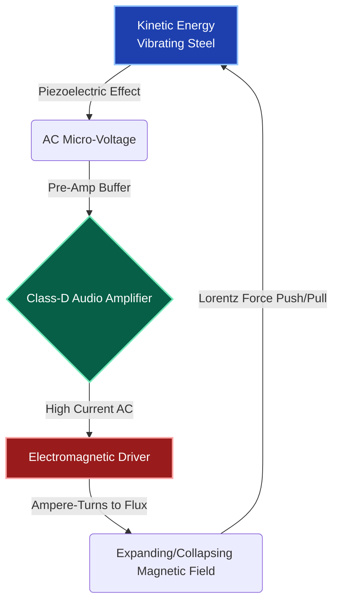
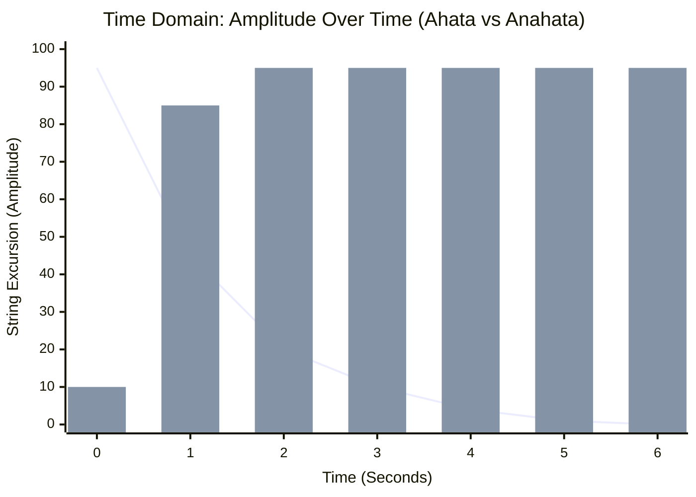

# Part 1.1: The Closed-Loop Feedback System (Ahata vs. Anahata)

## 1. The Acoustic Philosophy
Traditional acoustic instruments operate on the principle of **Ahata** (struck sound). Energy is injected once (via a pick, hammer, or finger), transferred to the surrounding air, and immediately begins to decay. The instrument acts as a decaying mechanical oscillator.

The Sympathetic Electromagnetic Array is designed to achieve **Anahata** (the un-struck, infinite vibration). It intercepts the decaying acoustic energy, amplifies it, and actively forces it back into the steel, creating a self-sustaining system that relies on continuous electrical power rather than a single kinetic strike.

## 2. The Electromechanical Loop Equation
To achieve infinite sustain, the system relies on the **Barkhausen Criterion** for oscillation, adapted for electromechanics. The total loop gain ($A_{loop}$) must be greater than or equal to $1$, and the phase shift around the loop must be a multiple of $360^\circ$ ($2\pi$).

$$A_{loop} = G_{piezo} \cdot G_{amp} \cdot G_{coil} \cdot G_{mech} \ge 1$$

Where:
*   $G_{piezo}$ = Efficiency of the receiver converting kinetic string motion to AC voltage.
*   $G_{amp}$ = Voltage gain of the Class-D amplifier.
*   $G_{coil}$ = Efficiency of the driver converting AC voltage into magnetic flux ($B_{ac}$).
*   $G_{mech}$ = Mechanical coupling of the magnetic flux physically moving the string.

If $A_{loop} < 1$, the string decays. If $A_{loop} > 1$, the string violently accelerates until it reaches physical maximum excursion (clipping against the frets or driver).

## 3. The Energy Circuit Architecture
The system is fundamentally an energy conversion loop. Understanding where the bottlenecks occur is critical for engineering the chassis.

### Time Domain: Standard Decay vs. Infinite Sustain

*(Line: Standard Acoustic Decay | Bars: Active Electromagnetic Sustain achieving Anahata).*