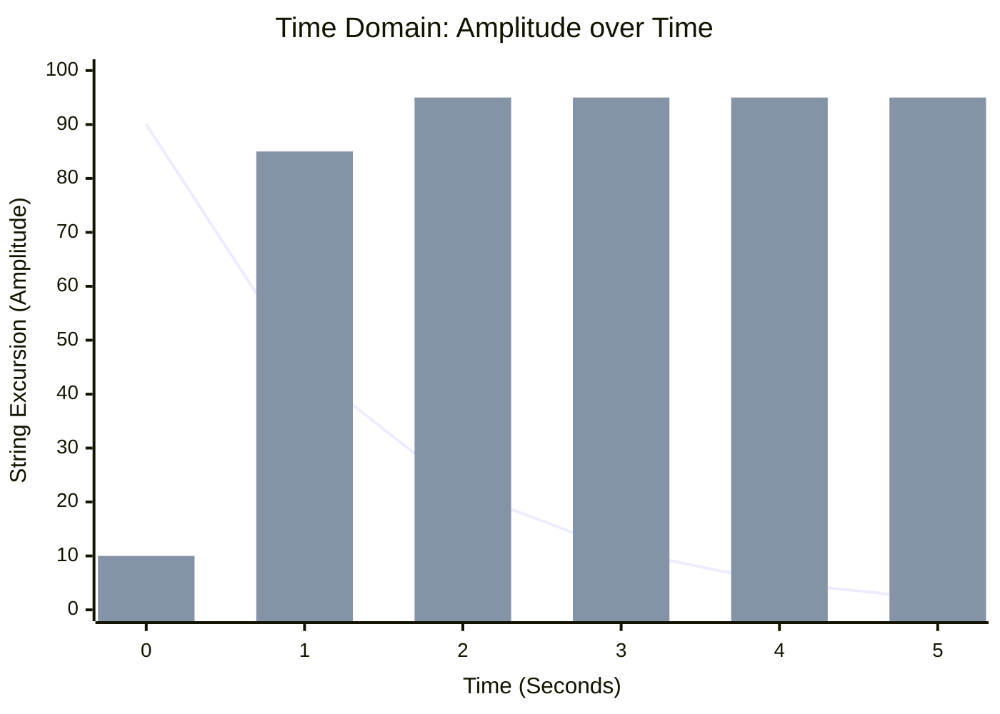
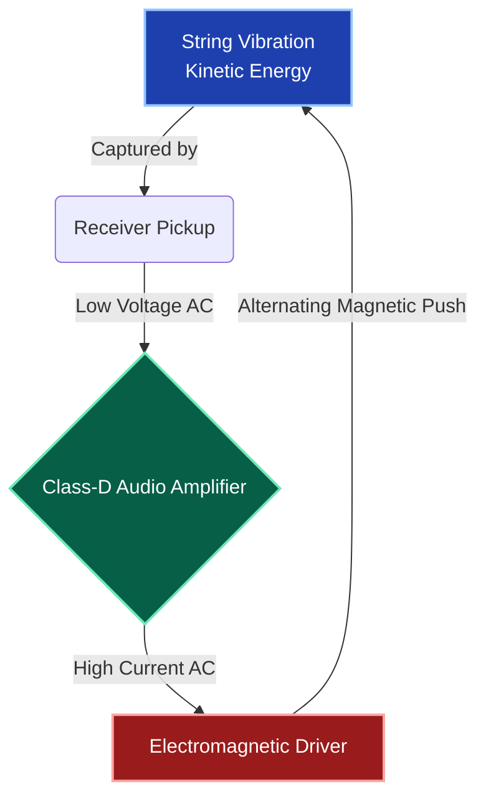

# Part 1.1: System Architecture Overview

## The Goal: From Ahata to Anahata (Infinite Sustain)
The Sympathetic Electromagnetic Array is not a traditional musical instrument. It is a **closed-loop electromechanical feedback system**. 

In acoustic philosophy, traditional instruments rely on *Ahata* (sound produced by striking or plucking). They act as decaying oscillators: a string is struck, energy is transferred to the air, and the note eventually dies. 

This system intercepts that decaying acoustic energy, amplifies it electrically, and injects it *back* into the string as raw kinetic force. The goal is to achieve *Anahata*—the unstruck, infinite, continuous vibration. The string will vibrate endlessly as long as power is supplied to the system.

### Time Domain: Standard Decay vs. Electromagnetic Sustain
The chart below illustrates the mechanical amplitude of a string over time. A standard string decays exponentially. The electromagnetic system captures the initial transient and forces the string into a continuous, maximum-amplitude state.

*(Line: Standard Acoustic Decay | Bars: Active Electromagnetic Sustain)*

### The Core Feedback Loop
To understand the engineering constraints of the instrument, you must view it as an energy circuit.

1. **The Source:** The string vibrates (or an external audio signal is introduced).
2. **The Sensor:** A pickup (piezoelectric or magnetic) converts the kinetic movement into a low-voltage AC electrical signal.
3. **The Engine:** A Class-D amplifier boosts this AC signal, pushing current ($I$) and wattage ($W$) based on the impedance ($Z$) of the load.
4. **The Actuator:** The electromagnetic driver converts the amplified AC electrical signal back into an expanding and collapsing magnetic field ($B_{ac}$).
5. **The Push:** This alternating magnetic field interacts with a powerful static magnetic bias ($B_0$), physically pushing and pulling the steel string, completing the loop.

## Active Drive vs. Sympathetic Resonance
This architecture utilizes two distinct methods of moving the steel strings or tines:

*   **Active Drive (Forced Oscillation):** The driver is physically placed underneath a specific string. The magnetic field directly grabs the steel and forces it to move. This is violent, instantaneous, and dictates the fundamental frequency of the system.
*   **Sympathetic Resonance (Passive Oscillation):** Strings that are *not* located directly over the driver will still vibrate if they are tuned to a harmonic integer (e.g., an octave or a perfect fifth) of the driven string. They absorb acoustic energy traveling through the wood chassis and the air.