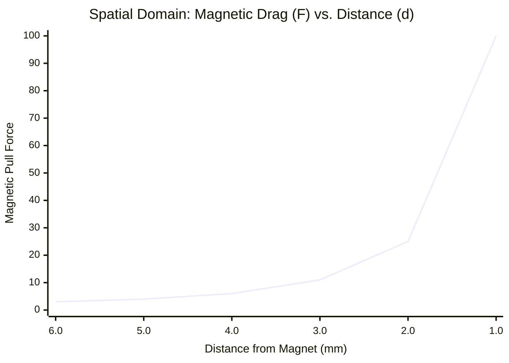
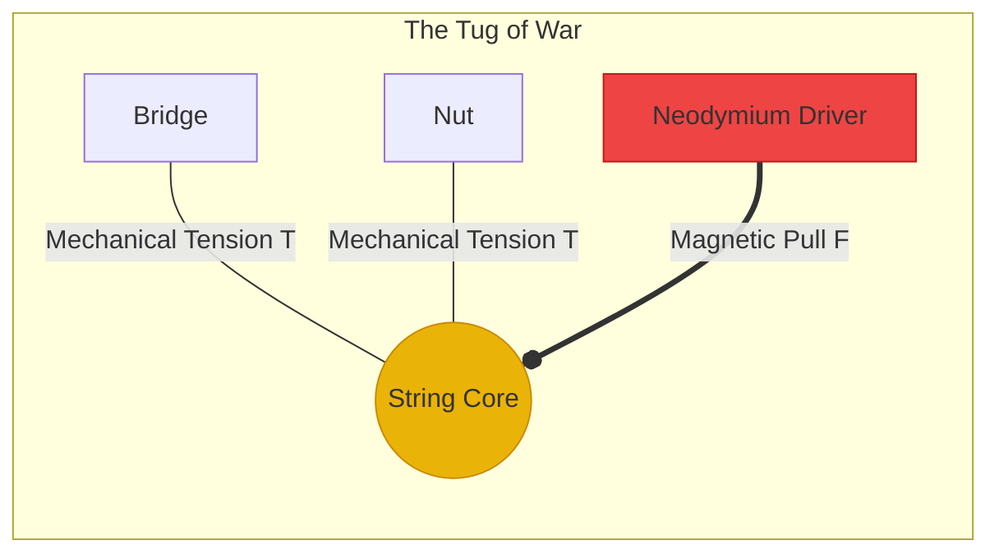

# Part 1.2: The Physics of Scale Length

The scale length ($L$)—the physical vibrating distance between the nut and the bridge—is the single most important mechanical variable in the instrument. It dictates the tension, the pitch stability, and whether the strings can survive the massive magnetic drag exerted by Neodymium electromagnets.

## 1. The Tension Equation

For a string of a given mass (gauge) vibrating at a specific frequency (pitch), the required tension is determined by the following fundamental acoustic equation:

$$
f = \frac{1}{2L} \sqrt{\frac{T}{\mu}}
$$

Where:
* $f$ = Frequency in Hertz (Hz)
* $L$ = Scale Length in meters (m)
* $T$ = Tension in Newtons (N)
* $\mu$ = Linear mass density of the string (kg/m)

To understand how scale length impacts our engineering, we rearrange the formula to solve for Tension ($T$):

$$
T = 4 \mu L^2 f^2
$$

### The Length-Tension Paradox
Notice that length ($L$) is squared in the tension equation. This means that tension scales exponentially, not linearly, with distance.

**If you keep the exact same string gauge (**$\mu$**) and the exact same tuning pitch (**$f$**):**
* Doubling the scale length requires **four times** the mechanical tension.
* Halving the scale length requires only **one-quarter** of the mechanical tension.

## 2. Magnetic Drag Resistance

This is where the physics of scale length directly collides with the physics of electromagnetism. To push a heavy steel string, you need a powerful static magnetic bias ($B_0$). If you use Neodymium magnets, that static pull follows the inverse-square law, getting exponentially stronger as the string gets closer to the pickup.

### Spatial Domain: The Inverse-Square Pull
The chart below illustrates how violently the magnetic drag increases as the string physically approaches the Neodymium driver.

This creates a literal tug-of-war between the **Mechanical Tension (**$T$**)** trying to keep the string straight, and the **Magnetic Pull (**$F_{pull}$**)** trying to suck the string down against the pickup.

### The Choke-Out (Magnetic Damping)
If $F_{pull}$ overwhelms $T$, the system crashes.
1. **Pitch Sharpening:** The magnet pulls the string out of a straight line, artificially stretching it and forcing the musical pitch sharp.
2. **Magnetic Braking:** The string becomes physically bound by the magnetic field. When the amplifier turns on to inject the alternating wave ($B_{ac}$), the string is too stiff to respond. It will not sustain.

**The Engineering Verdict:**
If you are using Neodymium magnets, **you must use a long scale length (e.g., 24 inches).** The massive mechanical tension of the longer scale length is the only force strong enough to fight off the immense magnetic drag of the Neodymium.