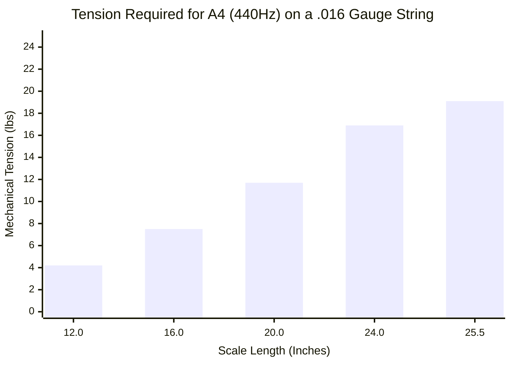

# Part 1.2: The Mathematics of String Tension (Mersenne's Laws)

The fundamental frequency of a tensioned string is dictated by **Mersenne's Laws**. Understanding this equation is critical because the required tension determines whether the guitar chassis will hold together, and whether the string is stiff enough to survive the massive magnetic drag of a neodymium electromagnet.

## 1. The Fundamental Tension Equation
The physical pitch of the string is derived from its length, its mass, and how tightly it is stretched:

$$f = \frac{1}{2L} \sqrt{\frac{T}{\mu}}$$

Where:
*   $f$ = Frequency in Hertz (Hz)
*   $L$ = Active Scale Length in meters (m)
*   $T$ = Tension in Newtons (N)
*   $\mu$ = Linear mass density of the string (kg/m)

To calculate how much physical stress is being placed on the instrument's bridge and tuning pegs, we rearrange the formula to solve for mechanical tension ($T$):

$$T = 4 \mu L^2 f^2$$

## 2. The $L^2$ Scale Length Penalty
Notice that the scale length variable ($L$) is squared in the tension formula. This means that changing the length of the guitar neck does not scale the tension linearly—it scales it exponentially.

If you attempt to use the exact same string gauge ($\mu$) to hit the exact same musical note ($f$):
*   **A 12-inch scale length** requires a very low baseline tension.
*   **A 24-inch scale length** requires exactly **4 times** the baseline tension.

### Performance Domain: Tension vs. Scale Length

## 3. Engineering Application: Surviving the Magnet
While low tension makes a string easier to press down (fret), it makes it highly susceptible to outside forces. 

When you place a powerful electromagnet under the string, it exerts a massive downward static pull. If you are building a system with **Neodymium** magnets, a 12-inch scale length is often too "floppy" to resist the magnet. The string will simply be pulled out of tune or magnetically locked to the pickup.

**The Solution:** You must use a longer scale length (24 to 25.5 inches). The massive mechanical tension acts as a structural defense mechanism, keeping the string rigid enough to resist the static magnetic drag while allowing it to vibrate efficiently.