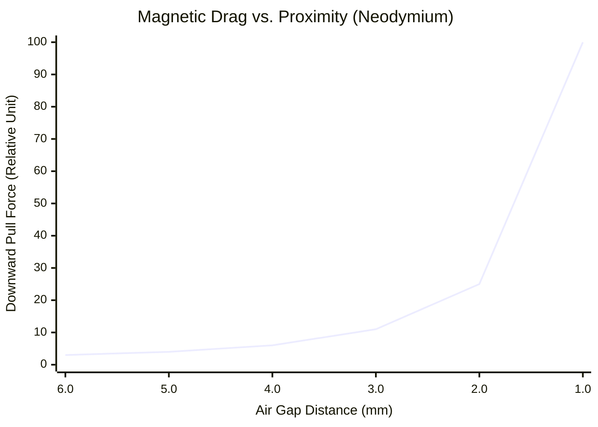
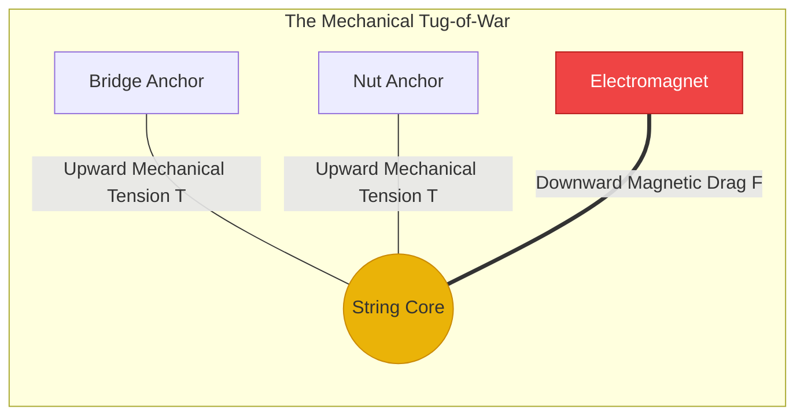

# Part 1.3: Magnetic Drag and the Inverse-Square Penalty

In an active sustainer system, the permanent magnet provides the static bias ($B_0$) required to give the AC coil field ($B_{ac}$) something to push against. However, this static magnet is simultaneously trying to pull the steel string downward and lock it in place. 

This creates a constant physical battle between the mechanical tension of the string and the magnetic drag of the driver.

## 1. The Inverse-Square Magnetic Pull
The downward force ($F_{pull}$) exerted by the permanent magnet on the steel string follows an inverse-square relationship based on the air gap distance ($z$):

$$F_{pull} \propto \frac{B_0^2}{z^2}$$

*   **The Proximity Danger:** Because the distance ($z$) is squared, cutting the air gap in half doesn't double the magnetic pull—it quadruples it.
*   **The Material Danger:** Because the magnetic flux ($B_0$) is squared, switching from a Ceramic magnet to a Neodymium magnet (which is roughly 3.5x stronger) increases the physical drag on the string by a factor of roughly **12x to 16x** at the exact same distance.

### Spatial Domain: The Crash Threshold

*(As the string breaches the 3.0mm threshold, the magnetic pull becomes violent and unmanageable).*

## 2. The Choke-Out (Magnetic Locking)
If $F_{pull}$ exceeds the string's mechanical restoring force (Tension), the system enters a failure state known as "Choking Out."

1.  **Static Displacement:** The string is physically bowed downward, forming a permanent V-shape pointing at the pickup.
2.  **AC Field Rejection:** When the amplifier sends an AC audio signal into the coil to push the string UP, the AC magnetic field is entirely overwhelmed by the massive static field pulling the string DOWN. The string remains rigidly locked in place.

## 3. The Engineering Verdict (Air Gap Tolerances)
To successfully design the chassis and action (string height) of the instrument, you must adhere to strict air-gap tolerances based on your magnet material.

*   **Ceramic (Ferrite) Drivers:** Can safely be placed **1.5mm to 2.0mm** away from the strings. The weak static field will not choke the string, allowing for maximum AC coil transfer.
*   **Neodymium Drivers:** Must be buried deep in the chassis, maintaining a minimum gap of **4.0mm to 5.5mm** away from the strings to prevent catastrophic locking and pitch distortion.