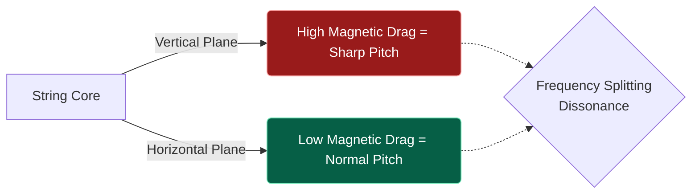
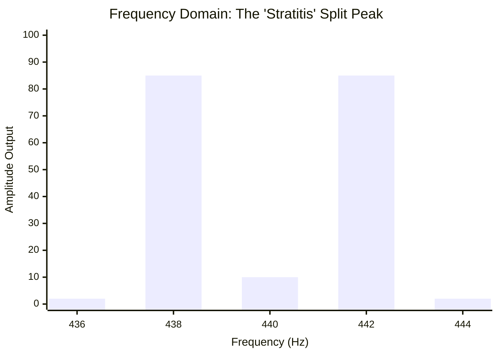

# Part 2.1: Tensioned Guitar Strings

When utilizing stretched, high-tension electric guitar strings as the primary acoustic resonator, the relationship between the string and the electromagnetic driver is defined by physical stretching and plane polarization. 

Unlike free-floating beams, a tensioned string has a fixed length. Any external force that bends the string out of a perfectly straight line physically stretches the metal, thereby increasing its tension.

## 1. Pitch Sharpening Under Static Magnetic Bias

When a powerful Neodymium electromagnet is placed beneath a tensioned string, the permanent magnetic field ($B_0$) exerts a constant downward force.

Because the string is locked at the bridge and the nut, pulling the center of the string downward physically stretches the core wire. According to the fundamental tension equation ($f \propto \sqrt{T}$), this artificial increase in tension causes the natural resonant frequency of the string to drift **sharp** (higher in pitch).

If the driver is placed too close, the string will be permanently out of tune. 

## 2. Inverse-Square Magnetic Pull and "Stratitis"

The most destructive phenomenon associated with placing powerful electromagnets under tensioned strings is known as **Frequency Splitting**, colloquially referred to by luthiers as "Stratitis."

### The Physics of the Split
A vibrating string does not just move up and down; it moves in an elliptical orbit. It vibrates in a vertical plane (perpendicular to the pickups) and a horizontal plane (parallel to the fretboard). 
*   The vertical vibration is directly fighting the massive pull of the Neodymium magnet.
*   The horizontal vibration is barely affected by the magnet.

Because the magnet alters the restoring force in only one plane, the string's unified fundamental frequency physically splits into two distinct, conflicting frequencies. 

### Frequency Domain: Visualizing Stratitis
When "Stratitis" occurs, the single, pure fundamental note splits into two warring peaks. These two frequencies crash into each other in the air, creating a dissonant, warbling "beat frequency" that sounds like a malfunctioning chorus pedal.

*(The graph above illustrates a target 440Hz note splitting into 438Hz and 442Hz peaks due to asymmetrical magnetic drag).*

### The Engineering Solution
To prevent Stratitis and extreme pitch sharpening on tensioned strings:
1.  **Lower the Driver:** Neodymium drivers must be placed at least **4.0mm to 6.0mm** away from the strings. 
2.  **Use Ceramic (Ferrite):** If the driver must be placed extremely close (1.0mm) to hunt high harmonics, it must utilize a lower-pull Ceramic magnet rather than Neodymium.