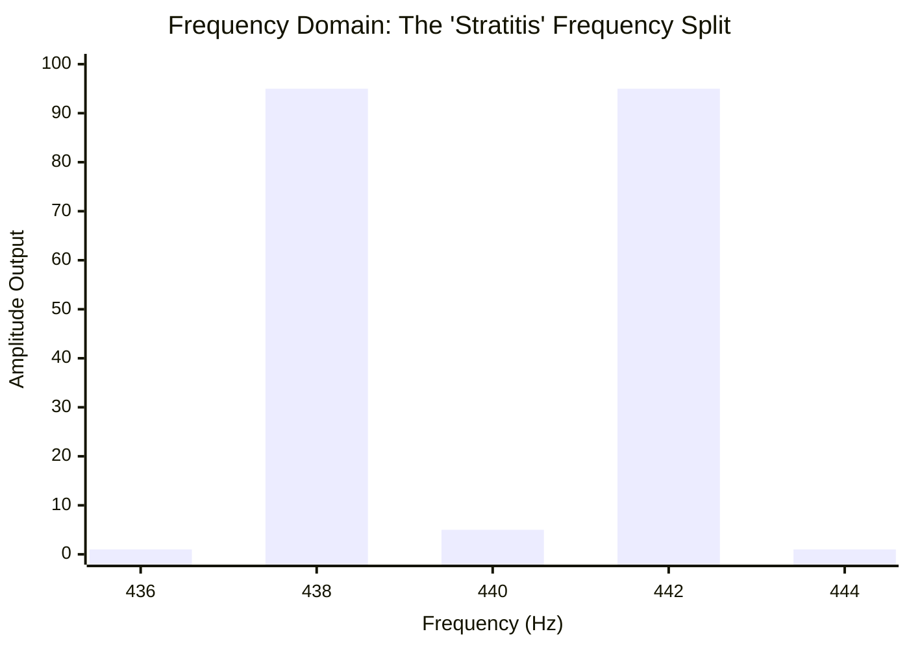

# Part 2.1: Tensioned Strings and Frequency Splitting

When utilizing stretched, high-tension electric guitar strings as the primary acoustic resonator, the string is locked at two points (the bridge and the nut). Because its length is fixed, any external force that bends the string out of a perfectly straight line introduces massive inharmonic side-effects.

## 1. Pitch Sharpening via Static Displacement
When a powerful electromagnet is placed beneath a tensioned string, it pulls the center of the string downward. 

Because the string is anchored at both ends, pulling the center downward forces the steel to physically stretch to cover the new, triangular distance. This artificially increases the mechanical tension ($T$) of the string.
*   According to Mersenne's Law ($f \propto \sqrt{T}$), higher tension equals a higher pitch.
*   **The Result:** Moving a Neodymium driver closer to a tensioned string will cause the string's resting musical pitch to aggressively drift **sharp**. 

## 2. Plane Polarization and "Stratitis"
The most destructive acoustic phenomenon caused by electromagnets acting on tensioned strings is known colloquially by luthiers as "Stratitis" (or Frequency Splitting).

A vibrating string does not just move up and down; it vibrates in complex, elliptical orbits. It moves in a **vertical plane** (perpendicular to the pickups) and a **horizontal plane** (parallel to the fretboard).

*   **The Physics:** The Neodymium magnet is located directly underneath the string. It exerts massive drag on the vertical plane, but almost zero drag on the horizontal plane.
*   **The Inharmonicity:** Because the magnet alters the restoring tension in only one plane, the string is essentially vibrating under two different tensions simultaneously depending on which way it is swinging. 
*   **The Sonic Result:** The single fundamental note physically tears in half, splitting into two distinct, conflicting frequencies. 

### Frequency Domain: The Split Peak
When the split frequencies hit the air, they crash into each other, creating a dissonant, warbling "beat frequency" that sounds like a malfunctioning ring-modulator or chorus pedal.

*(The graph above illustrates a target 440Hz A-note being split into competing 438Hz and 442Hz peaks due to asymmetrical magnetic drag on the planes).*

### The Solution for Active Arrays
To avoid Stratitis, the magnetic field must either be drastically weakened (by using Ceramic instead of Neodymium), or the driver must be physically lowered far enough away from the string that the difference in drag between the horizontal and vertical planes becomes negligible.