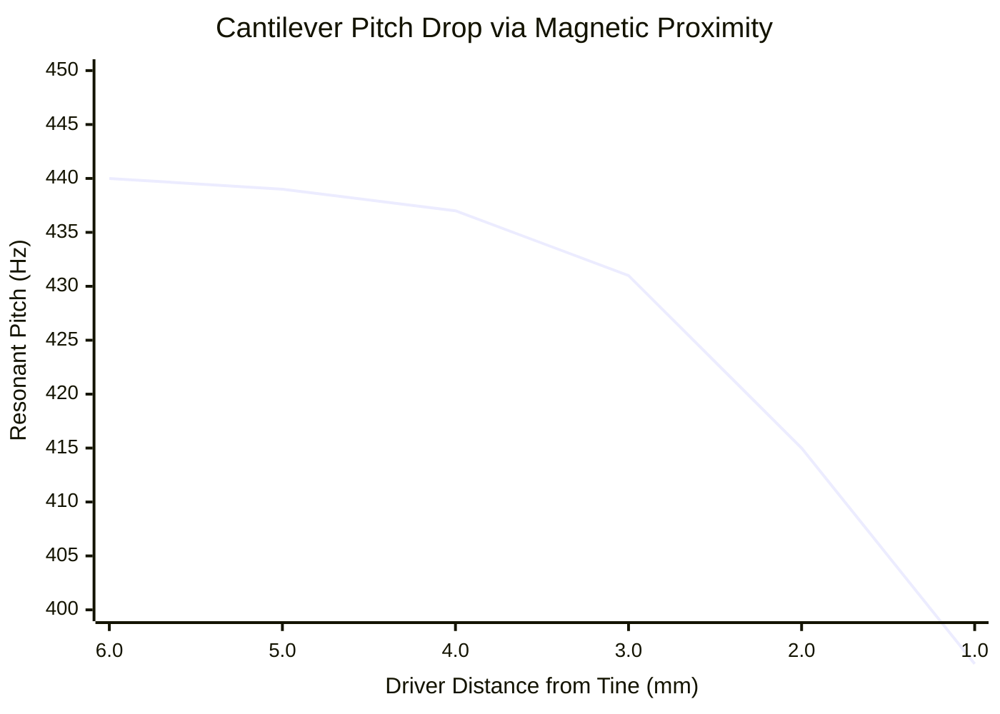

# Part 2.2: Cantilever Beams and Negative Spring Physics

Replacing tensioned guitar strings with free-floating high-carbon steel music wire (e.g., .047" diameter) fundamentally changes the physics of the instrument. 

When wire is rigidly clamped at only one end, it acts as a **Cantilever Beam**. It has absolutely zero mechanical tension. Its vibration is dictated entirely by its structural stiffness (Young's Modulus, $E$) and its mass geometry.

## 1. Euler-Bernoulli Stiffness Mathematics
The formula for the fundamental natural frequency of a cylindrical cantilever beam is vastly different from a tensioned string. 

$$f = \frac{0.5596}{L^2} \sqrt{\frac{E \cdot I}{\rho \cdot A}}$$

Where:
*   $L$ = Active length of the beam.
*   $E$ = Young's Modulus (Stiffness of the steel).
*   $I$ = Area Moment of Inertia.
*   $\rho$ = Density.
*   $A$ = Cross-sectional area.

**The $L^2$ Factor:** Unlike a guitar string, the frequency is dictated by the **Length Squared**. A microscopic physical change in length creates a massive, exponential shift in pitch. For shop fabrication using standard .047" steel wire, the formula simplifies to: $L \text{ (mm)} \approx 1045 / \sqrt{f}$.

## 2. The "Negative Spring" Pitch Drop Effect
Because a cantilever has no tension, its interaction with an electromagnet is completely inverted compared to a guitar string.

A cantilever tine acts as a mechanical spring. When bent, it wants to snap back to the center. We can define its stiffness as a mechanical spring constant ($k_{mech}$). 
*   **The Physics:** The permanent magnet sitting beneath the tine acts as a second spring pulling in the opposite direction. In mechanics, this acts as a **Negative Spring** ($k_{mag}$). 
*   **The Effective Stiffness:** The total stiffness of the system becomes $k_{eff} = k_{mech} - k_{mag}$. 
*   **The Sonic Result:** The magnetic pull physically subtracts from the structural stiffness of the steel. Because the beam is effectively "less stiff," it vibrates slower. Therefore, as you move an electromagnet closer to a cantilever tine, the pitch drops **flat**.

### Frequency Domain: Pitch vs. Proximity

*(Notice how radically the pitch plunges flat as the magnet approaches 2.0mm and overcomes the mechanical stiffness of the beam).*

## 3. Fabrication Rule: The Tuning Order of Operations
Because of the Negative Spring effect, you cannot tune a cantilever array on a workbench and *then* install the electromagnets. The moment the magnet is placed underneath the tine, the pitch will instantly drop out of tune.

**The Mandatory Process:**
1.  Assemble the rigid clamping block and cut the tines slightly long.
2.  Mount the complete electromagnet directly underneath the tines at its final, permanent height.
3.  *Only then* begin carefully filing or grinding the tips of the tines to raise their pitch up to the target frequency, allowing the static magnetic pull to be factored into the final resting pitch.