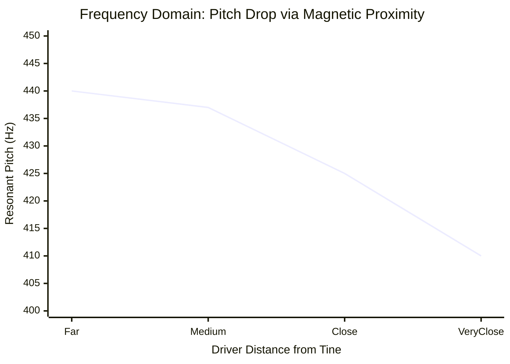
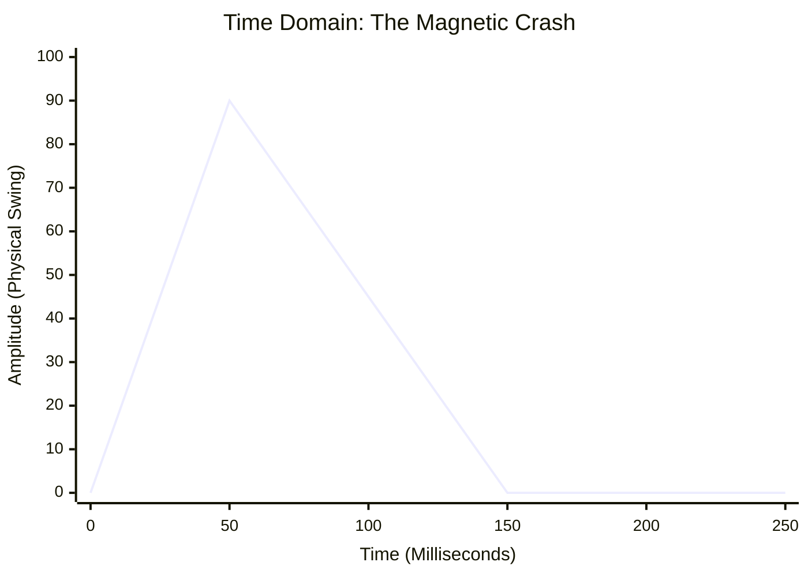

# Part 2.2: Cantilever Beams (Free-Floating Music Wire)

Replacing tensioned guitar strings with free-floating high-carbon steel music wire (.047" diameter) fundamentally changes the physics of the instrument. 

When wire is rigidly clamped at only one end, it acts as a **Cantilever Beam**. It has zero mechanical tension. Its vibration is dictated entirely by its physical stiffness (Young's Modulus, $E$) and its mass.

## 1. Stiffness-Driven Frequency Mathematics

The formula for the fundamental natural frequency of a cylindrical cantilever beam is:

$$
f = \frac{0.5596}{L^2} \sqrt{\frac{E \cdot I}{\rho \cdot A}}
$$

Unlike a guitar string, the frequency is dictated by the **Length Squared ($L^2$)**. A microscopic change in length creates a massive shift in pitch. For your specific .047" wire, this simplifies to the following bench-ready formula:

**$$L \text{ (in millimeters)} \approx \frac{1045}{\sqrt{f}}$$**

## 2. The "Negative Spring" Pitch Drop Effect

Because a cantilever has no tension, its interaction with a Neodymium electromagnet is completely inverted compared to a guitar string.

*   **The Physics:** The steel tine acts as a mechanical spring pulling upward to return to center. The magnet beneath it acts as a "negative spring" pulling downward. The magnetic pull effectively subtracts from the structural stiffness of the steel.
*   **The Result:** A less stiff beam vibrates slower. Therefore, as the Neodymium magnet gets closer to the free-floating tine, the pitch drops **flat**.

### Frequency Domain: The Negative Spring

**Fabrication Rule:** You must tune your tines *after* you have set the final height of your electromagnet, otherwise the driver will pull them out of tune the moment you install it.

## 3. Magnetic Locking (Crashing) Thresholds

Because a cantilever is free-floating, it has very little resistance against being bent downward at the tip. 

If you place a powerful Neodymium disc too close to the tine, the magnetic force ($F_{pull}$) will exceed the mechanical restoring force of the steel. 

```mermaid
graph LR
    A[Clamped Base] -->|Rigid Mount| B(Music Wire Tine)
    B -->|Free Tip| C{The Crash Zone}
    D[Neodymium Magnet] ===|Overwhelming Pull| C
    
    style A fill:#374151
    style D fill:#ef4444,stroke:#b91c1c,color:#fff
```

### Time Domain: The Crash
When the crash threshold is crossed, the tine does not sustain. It violently snaps downward and permanently locks itself against the steel slug of the pickup.

*(At 150ms, the magnetic pull overcomes the stiffness, locking the amplitude at 0).*

**The Engineering Solution:** Neodymium drivers must sit a minimum of **3.0mm to 5.0mm** below free-floating .047" tines to prevent magnetic locking.