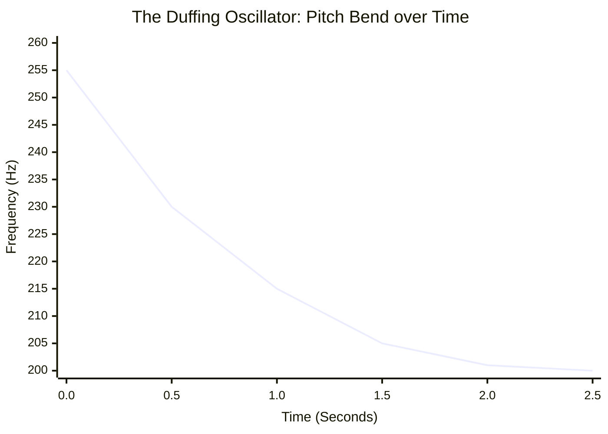
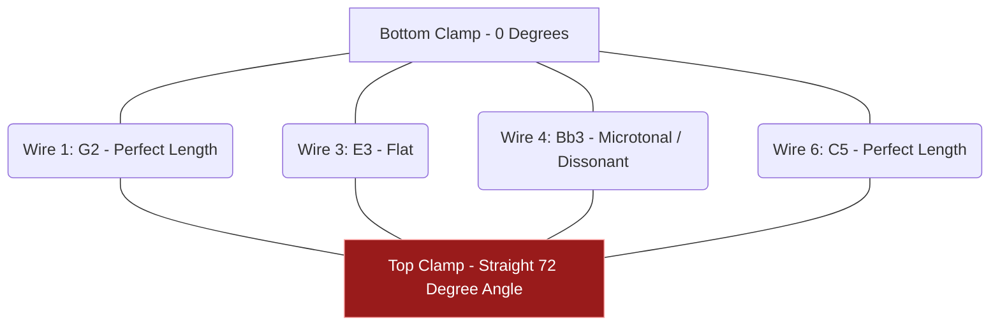

# Part 2.3: Fixed-Fixed Beams and the Duffing Oscillator

If you take a thick solid steel wire (like .047" music wire), lay it straight, and rigidly clamp *both* ends between heavy metal plates without applying stretching hardware (like tuning pegs), you create a highly unique acoustic architecture: the **Fixed-Fixed Zero-Tension Beam**.

## 1. The Stiffness Frequency Multiplier
By clamping the second side down, you are forcing the steel into a rigid arch whenever it vibrates. The constant for the first vibrational mode changes from the cantilever's $3.516$ up to a massive $22.373$.

**The Pitch Jump:** Simply clamping the free end of a wire increases its natural pitch by a factor of roughly **6.36x**. A length of wire that rumbled at 100 Hz as a cantilever will instantly scream at roughly 636 Hz when the second end is clamped. To hit low bass frequencies with this architecture, you must cut incredibly long physical spans of wire.

## 2. Dynamic Axial Tension (The Duffing Effect)
Because both ends of the wire are locked into heavy unmovable plates without tuning hardware, the wire cannot slip or yield. 

When your electromagnet forces the center of the wire to swing wildly upward or downward, the steel must physically stretch to achieve that curved shape.
*   **The Physics:** The wider the wire swings (Amplitude), the more it stretches. The more it stretches, the tighter it gets. This creates **Dynamic Axial Tension**.
*   **The Non-Linear Oscillator:** The frequency of the note becomes permanently tied to the volume. A loud, high-amplitude note will stretch the wire intensely, sounding very sharp (high pitch). As the kinetic energy bleeds off and the volume drops, the tension relaxes, and the pitch flattens back out to its baseline. 
*   **The Sonic Result:** Plucking or driving the string hard creates a natural, synthetic "pew-pew" pitch drop (like a laser sound effect or analog synthesizer glide). 

### Time-Frequency Domain: The Pitch Drop

## 3. The Microtonal Angle Problem
If you attempt to mount six of these fixed-fixed wires across a standard 50mm guitar pickup, you must use staggered clamping lengths to achieve different notes.

**The Straight Bar Defect:** If you attempt to use a single, straight piece of angled metal for the top clamp, you will ruin the tuning. Frequency follows an inverse-square mathematical curve ($1/\sqrt{f}$), but a straight bar decreases string length linearly. 

A straight-bar clamp will force the middle strings into bizarre, out-of-tune microtonal intervals (e.g., quarter-tones). To achieve standard tuning on a fixed-fixed array, you must abandon the straight bar and instead use **individual clamping blocks** for each wire, allowing you to manually set the exact millimeter length required for the inverse-square curve.