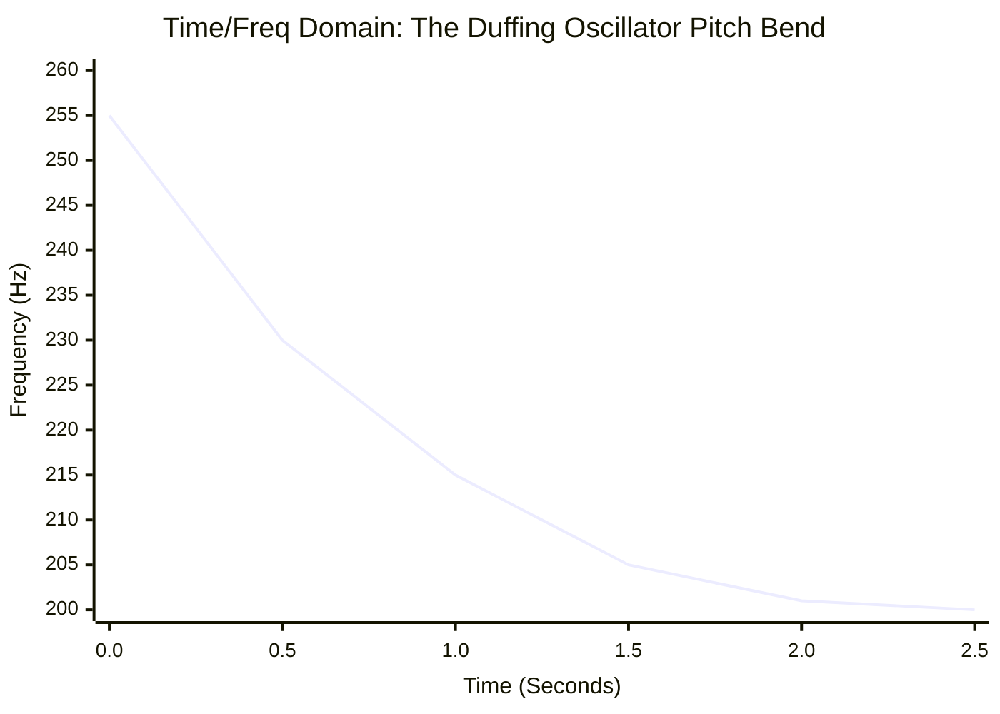
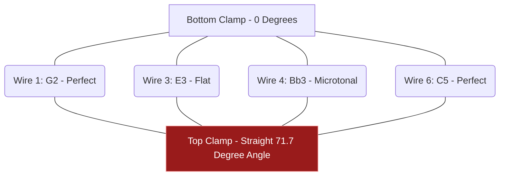

# Part 2.3: Fixed-Fixed Beams (Zero-Tension Clamped Wire)

When you take thick .047" solid steel wire and clamp *both* ends rigidly between metal plates without applying stretching hardware (like tuning pegs), you create a **Fixed-Fixed Beam with Zero Initial Tension**. 

This architecture combines the extreme stiffness of a cantilever with the dual-anchor geometry of a guitar string, creating highly unique acoustic phenomena.

## 1. The Frequency Multiplier (Pitch Jumping)

Clamping the second side of a wire forces it into a rigid arch whenever it vibrates. It becomes significantly harder to bend. 

The mathematical constant for a fixed-fixed beam ($22.373$) replaces the cantilever constant ($3.516$). 
**The Result:** Simply clamping the free end of a wire increases its pitch by a factor of roughly **6.36x**. A wire playing 100 Hz as a cantilever will instantly scream at ~636 Hz when clamped at both ends. 

## 2. Dynamic Axial Tension and the "Duffing Oscillator"

This is the most fascinating acoustic property of the fixed-fixed approach. 

Because both ends are locked in unmovable plates, the wire cannot slip. When the electromagnet forces the center of the wire to swing violently upward or downward, the steel must physically stretch to reach that curved shape.

*   **The Physics:** The wider the wire swings, the more it stretches, and the tighter it gets. This creates *dynamic axial tension*. 
*   **The Sonic Effect:** This creates a highly non-linear system known as a Duffing Oscillator. Loud, high-amplitude notes will sound incredibly sharp. As the volume decays, the tension relaxes, and the pitch drops back down to its resting frequency. It creates a natural "pew-pew" synthesizer drop effect.

### Time-Frequency Domain: The Duffing Pitch Drop
The chart below illustrates how the pitch of the note physically falls as the mechanical energy (amplitude) decays over time.

## 3. Clamp Geometry: The Microtonal Angled Bar

To lay multiple fixed-fixed wires across a standard 50mm pickup, you must use staggered clamping lengths to achieve different notes. 

If you attempt to use a single, straight piece of angled metal for the top clamp (connecting a long bass wire to a short treble wire), you run into a geometric flaw: **Frequency follows an inverse-square curve ($1/\sqrt{f}$), but a straight bar decreases linearly.**

### The Engineering Verdict
A straight angled bar will force the inner strings into bizarre, out-of-tune microtonal intervals. 

To achieve standard tuning on a fixed-fixed array, you must abandon the straight bar and instead use **individual clamping blocks** for each wire, allowing you to set the exact millimeter length required for the inverse-square frequency curve.