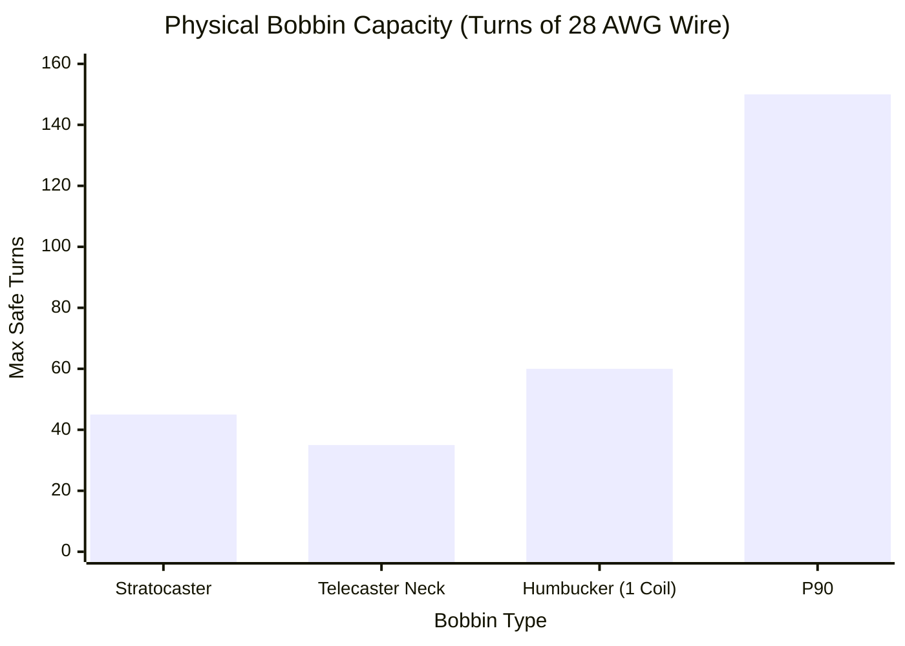
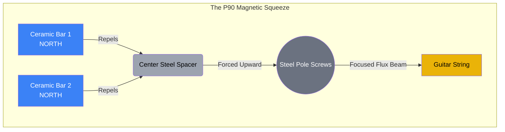

# Part 3.1: The P90 Architecture

When engineering an electromagnetic sustainer driver, the physical geometry of the plastic bobbin and the orientation of the permanent magnets are just as critical as the copper wire itself. While many DIY builders attempt to use standard Stratocaster (single-coil) or Humbucker bobbins, the **P90 architecture** is vastly superior for this specific application.

## 1. Bobbin Real Estate and Wire Gauge Capacity

Standard guitar pickups act as passive microphones. They are wound with hair-thin 42 AWG or 43 AWG wire to achieve high resistance (e.g., 6,000 to 10,000 ohms) in a tiny space.

Our driver is not a microphone; it is an active electromagnet taking a high-current AC signal from a Class-D amplifier. To survive this current without melting, we must use much thicker wire, specifically **28 AWG**. 

* **The Stratocaster Problem:** A standard single-coil bobbin is tall and narrow. Thicker 28 AWG wire fills it up almost instantly, often spilling over the edges before you can reach the required number of turns.
* **The P90 Solution:** P90 bobbins are famously wide and flat. This provides a massive physical footprint, allowing you to comfortably wrap 100 to 150 turns of thick 28 AWG wire without running out of physical space.

### Spatial Domain: Bobbin Capacity Comparison

## 2. The Magnetic "Squeeze" (Flux Focusing)

The most powerful advantage of the P90 lies in its magnetic circuit. Instead of using magnetic slugs (like a Strat) or a single magnet tucked under a coil (like a Humbucker), a P90 uses **two separate bar magnets** lying flat at the bottom of the bobbin.

These magnets are oriented so that their identical poles (e.g., North and North) face inward, pushing directly against a central steel spacer rail holding the pole screws.

### The Engineering Result
Because the two North poles repel each other, the static magnetic flux ($B_0$) cannot travel horizontally. It has nowhere to go but straight up through the high-permeability steel pole screws. This geometry creates a highly focused, high-density magnetic "laser beam" aimed exactly at the strings, maximizing your driving efficiency and minimizing stray magnetic fields that cause crosstalk.

## 3. Adjustable Aperture (Fretboard Radius Matching)

Strings on an instrument are not perfectly flat; they follow the curved radius of the fretboard (e.g., a 9.5" or 12" radius). 
* Magnetic pull follows the inverse-square law ($1/d^2$). If the driver is flat, the middle strings (D and G) will sit further away from the magnet and receive significantly less driving force.
* **The P90 Advantage:** P90s utilize threaded fillister-head steel screws. You can use a screwdriver to physically raise the middle pole pieces, perfectly contouring the magnetic field to match the curve of your strings. This ensures perfectly even sustain across the entire array.