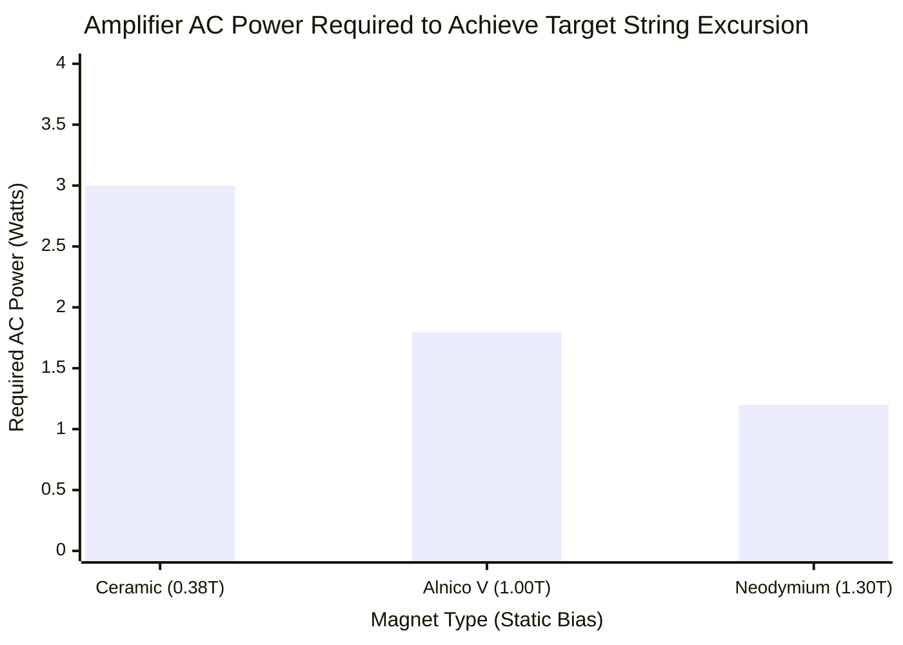
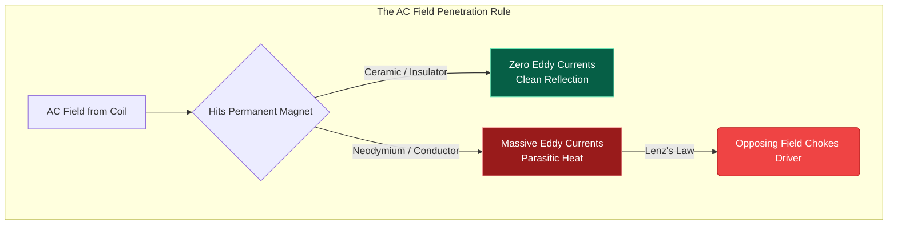

# Part 4.1: Magnetic Material Physics (Neodymium vs. Ceramic)

The permanent magnet in your driver provides the static magnetic bias ($B_0$). It acts as the "anvil" that the alternating AC field ($B_{ac}$) hammers against. Choosing between Neodymium (NdFeB) and Ceramic (Ferrite) fundamentally changes the electrical impedance requirements and the thermal profile of your entire instrument.

## 1. Remanence ($B_r$) and the Power Multiplier

The baseline strength of a permanent magnet is measured by its **Remanence ($B_r$)**, typically expressed in Tesla or Gauss.

*   **Ceramic (Grade 8 Ferrite):** $B_r \approx 0.38 \text{ Tesla}$ (3,800 Gauss)
*   **Neodymium (Grade N42):** $B_r \approx 1.30 \text{ Tesla}$ (13,000 Gauss)

The actual mechanical driving force ($F_d$) applied to the string is the product of the static field and the alternating field:
$$F_d \propto B_0 \cdot B_{ac}$$

Because Neodymium is roughly **3.4x to 4.0x stronger** than Ceramic, substituting a Ceramic magnet for a Neodymium magnet of the exact same size acts as a massive mechanical amplifier.

### Performance Domain: Wattage Requirements for Equal Excursion

*(With Neodymium, the massive static bias does the heavy lifting, allowing you to turn the Class D amplifier down to 1.2 Watts while achieving the exact same kinetic string movement).*

## 2. Electrical Resistivity ($\rho$) and Eddy Currents

The hidden danger of Neodymium lies in its atomic structure. Neodymium magnets are highly conductive metallic alloys (and are usually electroplated in nickel). Ceramic magnets are compressed ferrite powders acting as electrical insulators.

When your coil generates an alternating magnetic field ($B_{ac}$), Faraday's Law dictates that this changing field will induce a voltage inside any conductive material it touches.

*   **Ceramic ($\rho \approx 10^4 \, \Omega\cdot\text{m}$):** Because it is an insulator, no electrical currents can flow inside it. The AC field reflects off it perfectly.
*   **Neodymium ($\rho \approx 1.5 \times 10^{-6} \, \Omega\cdot\text{m}$):** Because it is highly conductive, the AC field induces violent, swirling **Eddy Currents** inside the magnet itself. 

**The Double Penalty of Neodymium Eddy Currents:**
1.  **Thermal Heat:** The electrical resistance of the metal converts your amplifier's AC power directly into localized heat.
2.  **Magnetic Choking (Lenz's Law):** The swirling eddy currents generate their own magnetic field that actively opposes your coil's $B_{ac}$ field, mechanically fighting the driver.

## 3. Engineering the Coil Match
Because of these physical differences, you must strictly pair your magnet type to your coil impedance target.

*   **The Ceramic Architecture:** Requires a **4-Ohm Coil**. You must push 3.0 Watts of continuous power to compensate for the weak $B_0$. The system will run hot, but because Ceramic is an insulator, it will not suffer from eddy current losses.
*   **The Neodymium Architecture:** Requires an **8-Ohm Coil**. You must restrict the amplifier to 1.5 Watts. The massive $B_0$ ensures infinite sustain, while the lower AC wattage prevents the Neodymium from generating catastrophic eddy current heat.