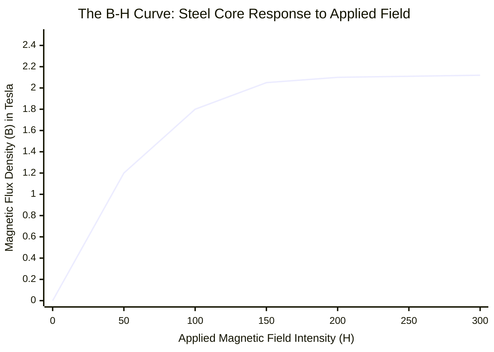

# Part 4.2: Core Saturation and Magnetic Overload

A common instinct in DIY electromagnet fabrication is "More magnets = More power." In reality, adding additional Neodymium magnets to an existing driver (like sticking extra discs to the sides of a P90) triggers a catastrophic physical failure known as **Core Saturation**.

## 1. The Physics of Magnetic Permeability ($\mu$)

The steel components in your driver (the spacer block, the slugs, or the blade) act as a "pipe" for the magnetic field. This ability to carry magnetic flux is called **Permeability ($\mu$)**.

However, just like a water pipe, a piece of steel has an absolute maximum capacity. 
*   Mild steel (1018 low carbon steel) can carry roughly **1.6 to 2.1 Tesla** of magnetic flux density. 
*   Once the steel reaches this limit, every single magnetic domain inside the metal is aligned. It is "magnetically saturated." It physically cannot hold one more drop of magnetic energy.

## 2. The B-H Curve and the AC Signal Death

To drive the string, your coil generates an alternating magnetic field ($\Delta B_{ac}$). For the string to feel this push, the $\Delta B_{ac}$ must be able to travel up through the steel core.

If you load your driver with too many Neodymium magnets, their massive static field ($B_0$) will push the steel core completely to its saturation limit (2.1 Tesla) before the amplifier even turns on.

### The Mathematics of Saturation
When the amplifier sends a positive voltage spike to push the string UP, it attempts to add its alternating flux to the core:
$$B_{total} = B_0 + B_{ac}$$

**If $B_0 \ge B_{max}$ (Saturation limit):**
The steel simply refuses to carry the $B_{ac}$ signal. The effective permeability of the steel drops to that of empty air ($\mu_0$). Your amplifier's energy is completely blocked from reaching the strings.

### Spatial Domain: The B-H Saturation Curve

*(Notice the "knee" of the curve. Once you cross 2.0 Tesla, adding more magnetic intensity (H) results in zero additional flux (B). Your AC signal dies on that flat plateau).*

## 3. The "Blowout" (Stray Flux and Crosstalk)

If you stack extra Neodymium discs onto a saturated core, the massive amount of excess magnetic flux has nowhere to go. It cannot enter the steel, so it violently "blows out" into the surrounding air.

1.  **Severe String Braking:** The massive stray field will reach up and grab the strings, magnetically locking them in place. The strings will feel stiff and lifeless.
2.  **Catastrophic Crosstalk (EMI):** The physical footprint of this magnetic bubble expands radically outward across the body of the instrument. If this stray field reaches your receiving pickup (the one sending audio to the amp), it will instantly cause an uncontrollable, high-pitched feedback loop, rendering the instrument unplayable.

**The Engineering Verdict:** Do not stack extra magnets onto a driver. If you are using two Neodymium bar magnets in a P90 architecture, you have already perfectly maximized the capacity of the steel core.