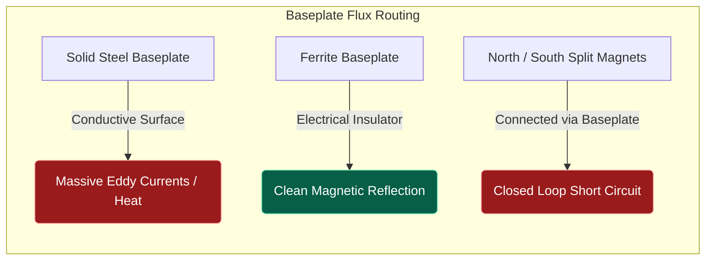

# Part 4.4: Flux Focusing and Reluctance Mathematics

Magnetic flux inherently behaves exactly like electricity: it always seeks the path of least resistance. In electromagnetics, this "resistance" to magnetic flow is called **Reluctance ($\mathcal{R}$)**.

Air has incredibly high reluctance ($\mu_0$). Steel has extremely low reluctance ($\mu$). By placing steel strategically around your coil, you can build a physical "highway" that forces the stray magnetic field out of the air and focuses it entirely into the strings. 

## 1. The Equation of Reluctance

To calculate the resistance of a magnetic path, we use the Reluctance equation:
$$\mathcal{R} = \frac{l}{\mu \cdot A}$$

Where:
*   $l$ = Length of the magnetic path.
*   $\mu$ = Magnetic permeability of the material.
*   $A$ = Cross-sectional area of the path.

If you wrap a "U-shaped" structure (a Yoke) around the bottom and sides of your driver, you drastically increase $A$ and $\mu$ for the return path of the magnetic field, plummeting the total reluctance ($\mathcal{R}$). The flux stops bleeding into the surrounding air (which causes EMI crosstalk) and routes directly upward.

## 2. Baseplate Material Selection (The Eddy Current Trap)

Adding a metal baseplate to the bottom of your driver to connect the magnetic poles is an excellent way to boost mechanical efficiency—**if** you use the correct material.

### Option A: Solid Steel (The Catastrophic Short Circuit)
If you glue a solid piece of mild steel to the bottom of your P90 magnets:
*   **The Physics:** You have created a highly conductive, massive secondary core. 
*   **The Result:** The AC magnetic field will induce massive swirling eddy currents across the solid metal sheet. The baseplate acts as a parasitic short-circuit, absorbing up to 80% of your amplifier's AC power and converting it into localized heat. Your driver will instantly become weak and muddy.

### Option B: Laminated Silicon Steel (The Holy Grail)
If you construct the baseplate out of thin layers of transformer steel, glued together:
*   **The Physics:** The electrical currents cannot cross the microscopic glue barriers between the sheets. Eddy currents are physically trapped and miniaturized, dropping parasitic power loss by roughly 99%.
*   **The Result:** You gain a massive boost in magnetic focus and string driving power, with zero heat generation. (Estimated mechanical gain: **+40% to +50%**).

### Option C: Ferrite / Ceramic Strips (The Safe Alternative)
If you glue un-magnetized ceramic/ferrite blocks to the bottom of the driver:
*   **The Physics:** Ferrite has high magnetic permeability ($\mu$) but is an absolute electrical insulator. 
*   **The Result:** Zero eddy currents can form because electricity cannot flow through ceramic. The magnetic field is cleanly focused upward. (Estimated mechanical gain: **+20% to +25%**).

## 3. The P90 Polarity Warning (The Horseshoe Loop)

If you are using two separate bar magnets in your P90 and you decide to use a flux-focusing baseplate, you must ensure the magnets have the **SAME polarity facing up (e.g., North/North)**.

If you accidentally flip one magnet to South-up, adding a steel baseplate will connect the North bottom to the South bottom.
*   **The Result:** You have just built a closed-loop Horseshoe Magnet. The magnetic flux will shoot up the North slugs, cross horizontally over the strings, travel down the South slugs, and flow straight through the baseplate.
*   **The Failure:** The magnetic field becomes entirely locked inside the metal. Almost zero magnetic flux will reach outward to actually push the strings vertically.

