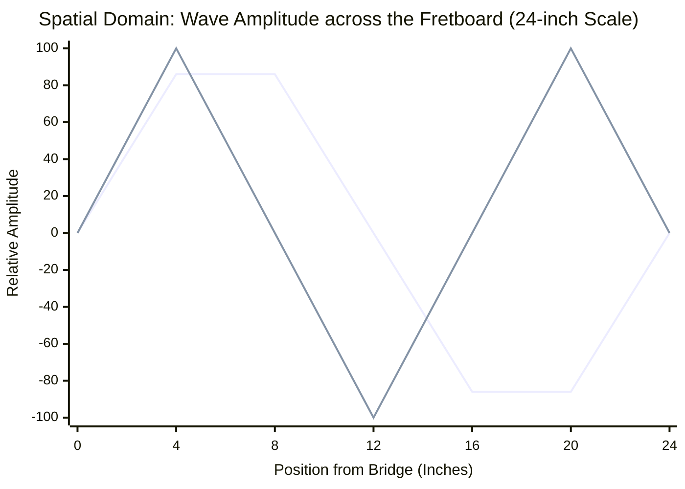

# Part 5.1: Standing Wave Mathematics and Wavelength ($\lambda$)

When a string (or fixed-fixed beam) is anchored rigidly at both ends, it cannot vibrate freely. The physical waves traveling back and forth across the steel bounce off the rigid anchors and collide with each other. At specific mathematical frequencies, these collisions perfectly align, creating **Standing Waves**. 

These standing waves are the only frequencies the system can naturally sustain. They are called **Harmonics** ($n$).

## 1. The Wavelength Equation
The physical length of the wave traveling through the steel is defined by the total scale length ($L$) and the harmonic number ($n$):

$$
\lambda_n = \frac{2L}{n}
$$

Where:
* $\lambda_n$ = Wavelength of the specific harmonic (in inches or mm).
* $L$ = Total scale length.
* $n$ = Integer (1, 2, 3, etc.).

For a 24-inch scale string:
* **The Fundamental ($n=1$):** $\lambda_1 = 48 \text{ inches}$. (The wave is twice as long as the string, forming one massive half-wave arch).
* **The 4th Harmonic ($n=4$):** $\lambda_4 = 12 \text{ inches}$. (The string is physically divided into four distinct 6-inch vibrating segments).

## 2. Nodes and Antinodes (The Physical Mechanics)
The interaction of these wavelengths creates specific geographic coordinates on the instrument chassis:

* **Nodes:** Points where the string remains mathematically stationary (0% amplitude). The wave crosses the zero-axis. Pushing a string here is like pushing a brick wall.
* **Antinodes:** Points where the string experiences absolute maximum kinetic excursion (100% amplitude). This is the absolute center of the vibrating segment.

### Spatial Domain: The First 3 Harmonics on a 24-Inch Scale

*(The top line represents the 3rd Harmonic dividing the string into thirds. The bottom line represents the 2nd Harmonic dividing it in half. Notice that 12.0 inches is a Node (0 amplitude) for the 2nd Harmonic, but an Antinode (-100 amplitude) for the 3rd Harmonic).*

## 3. The Prime Directive of Driver Placement
An electromagnetic driver functions by injecting kinetic energy ($F_d$) into the steel. To maximize energy transfer, the driver must be placed as close to an **Antinode** as possible.

If the driver is placed on a **Node**, the magnetic field will attempt to heave the steel upward, but the mathematics of the standing wave strictly forbid that coordinate from moving. The string will absorb the AC energy, convert it into localized heat or dissonant mechanical stress, and the harmonic will immediately decay.