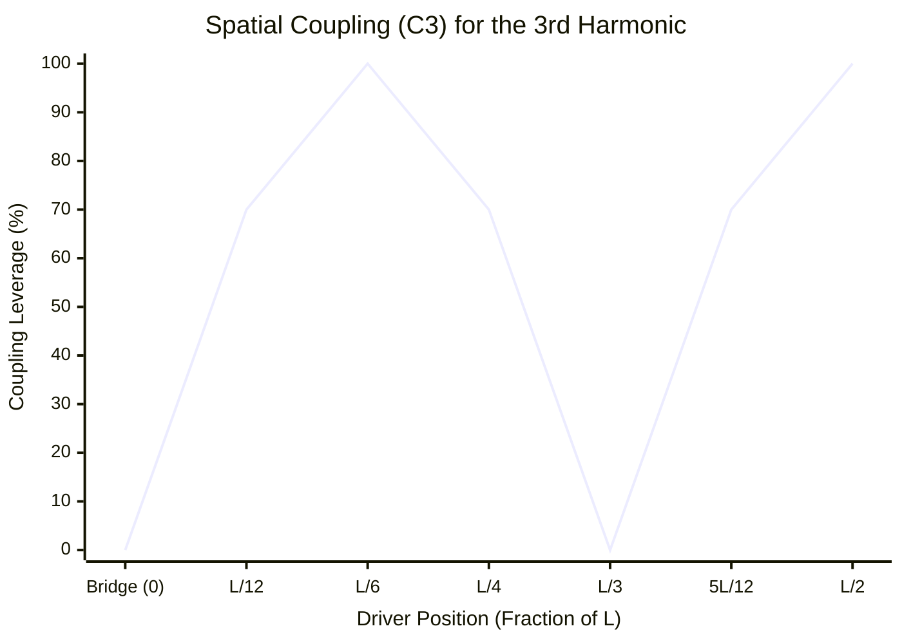

# Part 5.2: The Spatial Coupling Coefficient ($C_n$)

In real-world fabrication, you rarely mount a driver perfectly on a mathematical antinode for every single harmonic. A driver placed at $L/6$ perfectly hits the 3rd harmonic, but what leverage does it have over the 1st or the 5th?

To calculate the exact mechanical efficiency of your electromagnet at *any* arbitrary coordinate along the wood chassis, we use the **Spatial Coupling Coefficient ($C_n$)**.

## 1. The Coupling Equation
Because the amplitude of a standing wave follows a perfect sine curve, the efficiency of energy transfer at any given position ($x$) is calculated as:

$$
C_n = \left| \sin\left(\frac{n \cdot \pi \cdot x}{L}\right) \right|
$$

Where:
* $n$ = The harmonic number you are targeting.
* $x$ = The absolute physical position of the driver (measured from the bridge).
* $L$ = The total scale length.

The result ($C_n$) is a scalar value between $0.0$ and $1.0$. This represents the exact percentage of your amplifier's kinetic energy that successfully couples to the string's vibration.

## 2. Quantitative Example: The 6-Inch Placement
Assume a 24-inch scale length ($L = 24$). You route a cavity for your P90 driver exactly 6.0 inches from the bridge ($x = 6$).

**Targeting the Fundamental ($n=1$):**
$$C_1 = \left| \sin\left(\frac{1 \cdot \pi \cdot 6}{24}\right) \right| = \sin(0.25\pi) \approx 0.707$$
*Result: 70.7% Efficiency.* The driver transfers decent power, but wastes roughly 30% of its energy.

**Targeting the Octave ($n=2$):**
$$C_2 = \left| \sin\left(\frac{2 \cdot \pi \cdot 6}{24}\right) \right| = \sin(0.5\pi) = 1.000$$
*Result: 100% Efficiency.* Perfect alignment. This driver will effortlessly force the octave into infinite feedback.

**Targeting the Double-Octave ($n=4$):**
$$C_4 = \left| \sin\left(\frac{4 \cdot \pi \cdot 6}{24}\right) \right| = \sin(\pi) = 0.000$$
*Result: 0% Efficiency.* A complete dead zone. The driver is blind to the 4th harmonic.

### Spatial Domain: The 3rd Harmonic Efficiency Curve
The 3rd harmonic ($n=3$, Perfect 5th) is highly sought after for sympathetic drones. Observe how rapidly the spatial coupling coefficient fluctuates across the chassis.

*(Notice the sharp, jagged peaks. To force the 3rd harmonic to sing, you must mount the driver exactly at $L/6$ or $L/2$. Missing this coordinate by even an inch causes your leverage to plummet).*