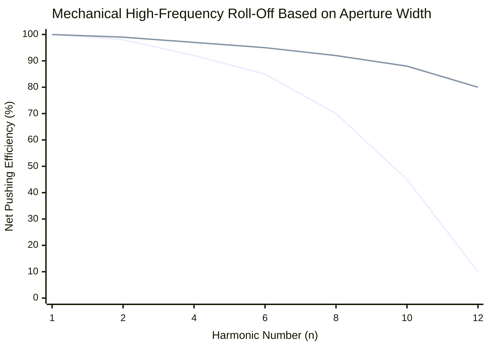

# Part 5.3: Magnetic Aperture and Mechanical Low-Pass Filtering

The Spatial Coupling equation ($C_n$) assumes your driver is an infinitely small point ($x$). In reality, electromagnetic drivers have physical width. This width is called the **Magnetic Aperture**.

*   A standard Stratocaster single-coil aperture is narrow ($\approx 5\text{mm}$).
*   A dual-magnet P90 aperture is extremely wide ($\approx 18\text{mm}$ to $22\text{mm}$).

When pushing high-frequency harmonics (which have very short wavelengths), the physical width of a P90 triggers a massive physical flaw: **Internal Phase Cancellation**.

## 1. Wavelength vs. Aperture Width

Let's calculate the wavelength ($\lambda$) of the 10th harmonic on a 24-inch scale (approx. 610mm):

$$
\lambda_{10} = \frac{2 \cdot 610\text{mm}}{10} = 122\text{mm}
$$

A standing wave consists of a positive swing (up) and a negative swing (down). Therefore, the distance between an Antinode (maximum UP) and a Node (zero) is exactly $\frac{\lambda}{4}$.
*   For the 10th harmonic, the distance from peak-to-zero is $122 / 4 = \mathbf{30.5\text{mm}}$.

## 2. The Aperture Cancellation Effect

If your driver has a magnetic aperture of 22mm (like a P90), its magnetic field spans nearly the entire distance between a node and an antinode for high harmonics. 

When the amplifier sends a positive voltage spike to push the string UP:
*   The center of the P90 pushes UP on the antinode (helping the wave).
*   The outer edges of the P90's magnetic field are simultaneously pushing UP on segments of the string that are supposed to be swinging DOWN. 

**The Physics Verdict:** The wide magnetic field of the P90 physically fights itself across the very short distances of high-frequency standing waves. The driver acts as a physical **Low-Pass Filter**.

### Frequency Domain: Driver Efficiency Roll-Off

*(The top line represents a wide 22mm P90 driver. Notice how rapidly it loses the ability to push harmonics above $n=8$. The bottom line represents a narrow 5mm blade driver, which maintains excellent high-frequency leverage).*

## 3. Engineering Application
*   **The Center Bass Driver ($L/2$):** A P90 is the perfect architecture here. The fundamental wavelength ($\lambda_1$) is massive (48 inches). The wide 22mm aperture easily fits inside this wave, coupling immense brute-force power to the string without phase cancellation.
*   **The Harmonic Screamer ($L/6$):** If you are trying to force extremely high harmonics (e.g., $n=8$ or higher) to ring infinitely, a wide P90 will struggle. You would achieve much faster harmonic blooming by using a narrow **Laminated Steel Blade** driver for the $L/6$ position.