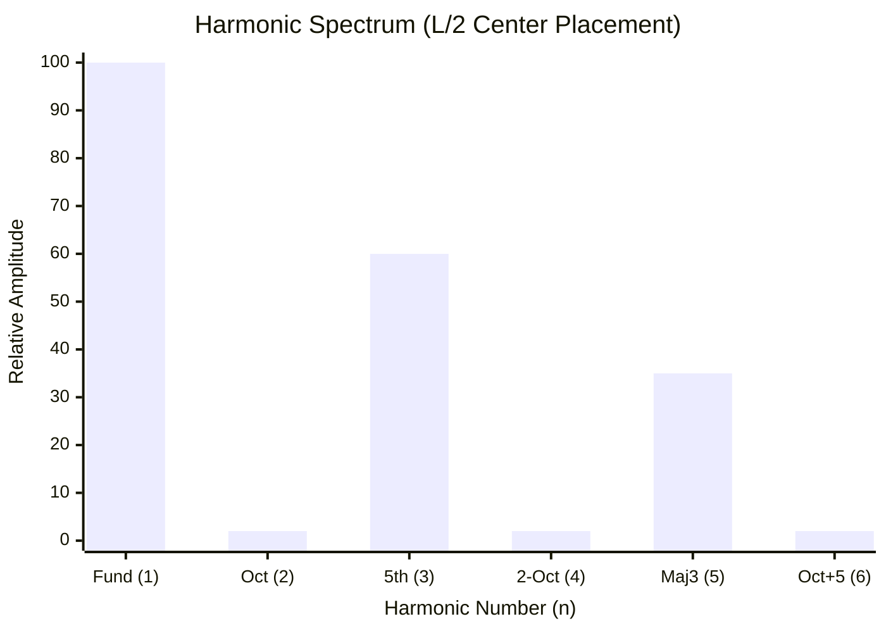
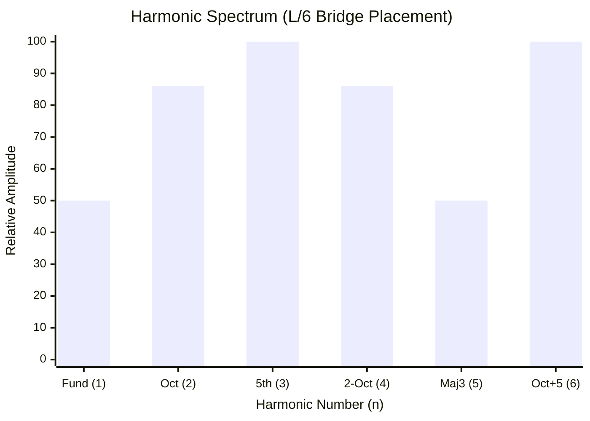

# Part 5.3: Timbre and Placement (The L/2 vs. L/6 Architectures)

The physical coordinate of your driver does not just dictate *if* the string vibrates; it fundamentally dictates the **timbre** (tone color) of the resulting audio. 

By strategically choosing where to route the pickup cavities in your wood chassis, you are physically hard-coding the EQ and harmonic structure of the instrument.

## 1. The $L/2$ Architecture (The Synth Drone)

Placing your massive Neodymium driver dead center on the string ($L/2$) creates a highly specific acoustic filter.

*   **The Physics:** As calculated by the $C_n$ equation, $L/2$ is an antinode for all odd harmonics (1, 3, 5) and a complete node for all even harmonics (2, 4, 6).
*   **The Sonic Impact:** A sound wave composed entirely of odd-order harmonics mathematically approximates a **Square Wave**. 
*   **The Vibe:** The instrument will produce a deep, unyielding, massive bass drone. It will sound less like a vibrating guitar string and more like a vintage Moog synthesizer, a clarinet, or a foghorn. It lacks the "shimmer" of octaves, resulting in a dark, hollow, and incredibly powerful sonic pillar.

### Frequency Domain: The $L/2$ Output Spectrum

*(Notice the complete death of the even-numbered octaves. The energy is funneled entirely into the odd harmonics).*

## 2. The $L/6$ Architecture (The Harmonic Screamer)

Placing a driver near the bridge—specifically at the $L/6$ coordinate (e.g., 4.0 inches away from the bridge on a 24-inch scale)—flips the acoustic physics entirely.

*   **The Physics:** The $L/6$ coordinate is relatively close to the bridge, meaning it is terrible at moving the massive, slow fundamental wave ($n=1$ efficiency is only ~50%). However, $L/6$ is the absolute peak antinode for the 3rd harmonic (the Perfect 5th) and the 6th harmonic (the high ringing chime). 
*   **The Sonic Impact:** Because the fundamental is mechanically suppressed and the upper overtones are mechanically leveraged, the note will immediately try to "bloom" or "flip" up into a screaming harmonic. 
*   **The Vibe:** This sounds like classic, blistering amplifier feedback. It is incredibly bright, evolving, and rich with high-frequency "sparkle."

### Frequency Domain: The $L/6$ Output Spectrum

*(Notice the massive surge in the 3rd and 6th harmonics. The fundamental is pushed to the background, allowing a rich, complex mixture of even and odd overtones to dominate the audio).*

## 3. The Master Strategy: The Dual-Array

By understanding these two extremes, the ultimate structural design for a sympathetic array becomes obvious: **You must use both.**

1.  **The Engine:** Mount your 8-Ohm Neodymium driver at exactly $L/2$. This provides the unstoppable, un-chokable fundamental power required to keep the heavy steel moving forever.
2.  **The Color:** Mount your 4-Ohm Ceramic driver at exactly $L/6$ (or $L/4$). This acts as your "EQ" switch. By turning this driver on (and experimenting with in-phase vs. out-of-phase wiring), you can inject screaming high-frequency overtones directly into the massive Neodymium bass wave, creating a hyper-complex, evolving wall of sound.