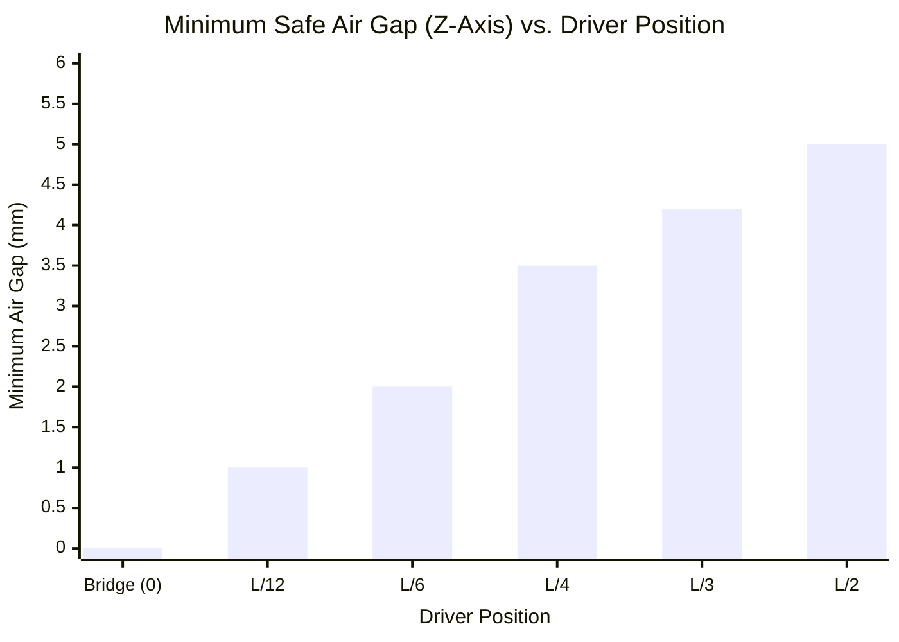

# Part 5.4: Z-Axis Excursion Limits (The String Clearance Curve)

Most spatial geometry focuses on the X-axis (where to route the pickup cavity horizontally). However, the physical mechanics of the vibrating string dictate a rigorous set of rules for the **Z-Axis** (how close the driver can be mounted vertically beneath the string).

Because magnetic driving force ($F_d$) increases exponentially as the air gap decreases ($F_d \propto 1/d^2$), you want the driver as close to the string as possible. But the string's physical swing (Excursion Envelope) limits this clearance.

## 1. The Amplitude Envelope Equation
When a string vibrates at its fundamental frequency ($n=1$), it forms a parabolic arch. The physical maximum swing of the string ($A_x$) at any given coordinate ($x$) along the fretboard is determined by:

$$
A_x = A_{max} \cdot \sin\left(\frac{\pi \cdot x}{L}\right)
$$

Where $A_{max}$ is the absolute maximum excursion occurring at the dead center of the string ($L/2$). 

If you pluck a low E-string aggressively, it might have an $A_{max}$ of **$\pm 2.5\text{mm}$**.
*   **At the Center ($L/2$):** $2.5 \cdot \sin(0.5\pi) = \mathbf{2.5\text{mm}}$ of swing.
*   **Near the Bridge ($L/6$):** $2.5 \cdot \sin(0.166\pi) = \mathbf{1.25\text{mm}}$ of swing.

## 2. The Inverse Clearance Rule
This amplitude envelope forces a critical mechanical trade-off when mounting your dual drivers. 

### The $L/2$ Center Driver (High Clearance Penalty)
Because the string swings so violently in the center, you cannot mount the driver close to the string. 
*   **The Fret-Slap Failure:** If you mount a Neodymium P90 1.5mm away from the string at $L/2$, the string will immediately slam into the plastic bobbin or the metal slugs on the down-swing. 
*   **The Adjustment:** You must sink the center driver deep into the chassis, maintaining an air gap of at least **4.0mm to 5.0mm**. Because it is further away, you *must* use Neodymium magnets here to project enough flux across that massive air gap to successfully couple with the string.

### The $L/6$ Bridge Driver (Low Clearance Advantage)
Because the string is physically tethered to the bridge nearby, it is very stiff and swings in a very tight arc. 
*   **The Proximity Bonus:** At $L/6$, the string's excursion is cut in half. Therefore, you can mount the offset driver significantly closer (e.g., **1.5mm to 2.0mm**) without any risk of the string colliding with the pickup.
*   **The Adjustment:** Because the air gap is so small, the inverse-square law provides an exponential boost to the magnetic leverage. Therefore, you can successfully use weaker **Ceramic magnets** in this position and still achieve massive electromagnetic drive.

### Spatial Domain: Required Physical Clearance Margin

*(The graph represents the parabolic physical boundary. You must mount your drivers *below* these measurements to prevent kinetic collision).*