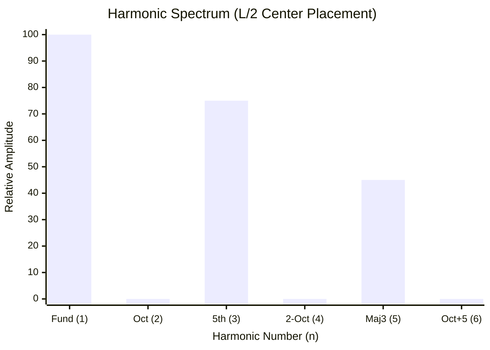
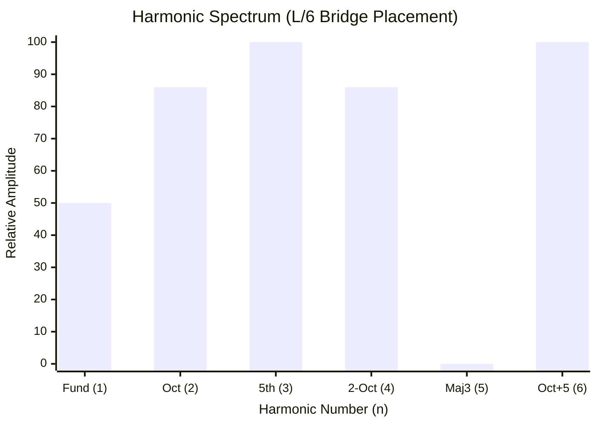

# Part 5.5: Timbre Architectures (The L/2 vs. L/6 Sonic Output)

By combining the Spatial Coupling ($C_n$), the Aperture Roll-Off, and the Z-Axis Excursion Limits, we can definitively chart the exact acoustic "flavor" (Timbre) that your two drivers will produce when activated.

Routing your pickup cavities into the wood chassis is not just a mechanical requirement; it is literally hard-coding the EQ, harmonic structure, and frequency response of the instrument.

## 1. The $L/2$ Architecture (The Fundamental Drone)
**Specs:** Mounted at 12.0 inches. Neodymium Magnets. 4.5mm Air Gap.

Because $L/2$ sits exactly on the antinode for all odd harmonics, and exactly on the node for all even harmonics, it acts as a mathematically perfect comb filter.
*   **The Sonic Impact:** A waveform composed entirely of odd-order harmonics (1, 3, 5, 7) mathematically approximates a **Square Wave**. 
*   **The Vibe:** The instrument will lose its "guitar-like" shimmer. It will produce a deep, unyielding, massive bass drone that sounds remarkably like a vintage Moog synthesizer, a clarinet, or a foghorn. It is dark, hollow, and incredibly powerful.

### Frequency Domain: The $L/2$ Output Spectrum

*(Notice the complete death of the even-numbered octaves. The amplifier's energy is funneled entirely into pushing the odd harmonics).*

## 2. The $L/6$ Architecture (The Harmonic Screamer)
**Specs:** Mounted at 4.0 inches. Ceramic Magnets. 1.5mm Air Gap.

Mounting the driver near the bridge flips the acoustic physics entirely. Because $x$ is small, the spatial coupling for the massive fundamental wave drops to roughly 50%. However, $L/6$ is the absolute peak antinode for the 3rd harmonic (the Perfect 5th) and the 6th harmonic (the high ringing chime).

*   **The Sonic Impact:** Because the fundamental is mechanically suppressed and the upper overtones are mechanically leveraged, the note will immediately try to "bloom" or "flip" up into a screaming harmonic. 
*   **The Vibe:** This sounds like classic, blistering amplifier feedback. It is incredibly bright, evolving, and rich with high-frequency "sparkle."

### Frequency Domain: The $L/6$ Output Spectrum

*(Notice the massive surge in the 3rd and 6th harmonics, and the total cancellation of the 5th harmonic. The fundamental is pushed to the background, allowing a complex, swirling mixture of overtones to dominate the audio).*

## 3. The Master Superposition Strategy
By hard-wiring these two extremes into your chassis, the ultimate resonance strategy becomes obvious: **Use the $L/6$ driver to inject high-frequency color into the massive $L/2$ bass wave.** By wiring them together with phase switches, you can force these two spectra to overlap, creating an impossibly rich wall of sound.