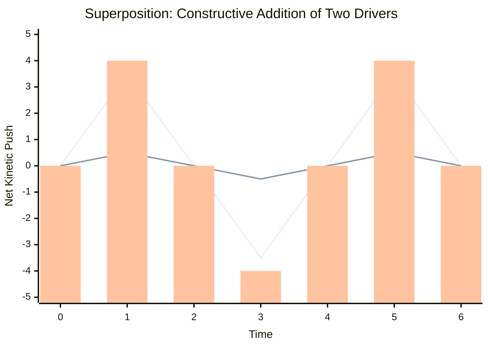

# Part 6.1: The Principle of Superposition and Net Force ($F_{net}$)

When a single string is subjected to multiple electromagnetic drivers simultaneously, the string cannot respond to each driver individually. It can only respond to the total, combined sum of their forces at any given millisecond. 

In physics, this is known as the **Principle of Superposition**. To calculate whether your multi-driver array will successfully sustain a harmonic or instantly choke it out, we must calculate the **Net Mechanical Force ($F_{net}$)**.

## 1. The Superposition Equation

The total force pushing or pulling the string for any specific harmonic ($n$) is the mathematical sum of every driver's individual leverage. 

$$F_{net} = \sum_{i=1}^{k} \left[ C_{n,i} \cdot M_i \cdot P_i \right]$$

Where:
*   $k$ = The total number of active drivers.
*   $C_{n,i}$ = The Spatial Coupling Coefficient of driver $i$ for harmonic $n$.
*   $M_i$ = The Magnetic Power Multiplier (e.g., $1.0$ for Ceramic, $3.5$ for Neodymium).
*   $P_i$ = The Electrical Polarity/Phase of the driver ($+1$ for In-Phase, $-1$ for Out-of-Phase).

## 2. In-Phase Amplification (The 1st Harmonic)

Let's calculate what happens when both of your drivers attempt to push the fundamental wave ($n=1$). 
*   **Driver 1 (Neodymium):** Placed at Center ($L/2$). $M_1 = 3.5$. Polarity = $+1$.
*   **Driver 2 (Ceramic):** Placed at Bridge ($L/6$). $M_2 = 1.0$. Polarity = $+1$.

**Step A: Calculate Spatial Coupling ($C_n$)**
*   $C_{1,1} = \sin(1 \cdot \pi \cdot 0.5) = 1.0$
*   $C_{1,2} = \sin(1 \cdot \pi \cdot 0.166) = 0.5$

**Step B: Calculate Vector Sum**
$$F_{net} = (1.0 \cdot 3.5 \cdot 1) + (0.5 \cdot 1.0 \cdot 1)$$
$$F_{net} = 3.5 + 0.5 = \mathbf{+4.0}$$

**The Physical Result:** Both drivers are working in perfect harmony. The Ceramic driver successfully adds its pushing power to the massive Neodymium driver. The string experiences a massive, synchronized $+4.0$ upward heave, throwing it into a violent, high-amplitude fundamental oscillation.

### Time Domain: Superposition Wave Addition

*(The top line represents the Neo driver. The middle line represents the Ceramic driver. The bars represent the combined $F_{net}$ the string actually feels).*