# Part 6.3: Phase Inversion Mechanics (The Harmonic Accelerator)

To solve the destructive interference outlined in Part 6.2, we must introduce a mechanical override into the circuit: **The Phase Inversion Switch**. 

By wiring the offset Ceramic driver to a standard DPDT (Double-Pole Double-Throw) toggle switch, you can instantly reverse the flow of AC current through its copper coil. This flips its mechanical polarity from $+1$ to $-1$.

## 1. Fixing the 3rd Harmonic 
Let's re-run the 3rd harmonic ($n=3$) equation. This time, we flip the Phase Switch on the Ceramic Driver so its Polarity = $-1$.

*   **Driver 1 (Neo @ $L/2$):** $C_{3,1} = -1.0$ | $M_1 = 3.5$ | Polarity = $+1$
*   **Driver 2 (Ceramic @ $L/6$):** $C_{3,2} = 1.0$ | $M_2 = 1.0$ | Polarity = $\mathbf{-1}$

**Calculate Vector Sum:**
$$F_{net} = (-1.0 \cdot 3.5 \cdot 1) + (1.0 \cdot 1.0 \cdot -1)$$
$$F_{net} = -3.5 - 1.0 = \mathbf{-4.5}$$

### The Mechanical Synchronization
By flipping the switch, the Ceramic driver is now pulling **DOWN** at the exact millisecond the Neodymium driver is pulling **DOWN**. 
*   **The Physics:** Both drivers are now perfectly synchronized with the natural "see-saw" shape of the 3rd harmonic wave. 
*   **The Result:** The total force jumps to a massive absolute value of $4.5$. This triggers **Constructive Interference**. The 3rd harmonic (the Perfect 5th) will instantly explode out of the string, screaming at maximum volume.

## 2. Excursion vs. Sonic Amplitude
The Phase Switch does not just change the math; it radically alters the physical behavior of the string, forcing a trade-off between visual movement (Excursion) and audible high frequencies (Sonic Amplitude).

### Mode A: Switch UP (In-Phase / Fundamental Mode)
*   **Physical Excursion:** MAXIMUM. Both drivers heave in the same direction, pushing the massive fundamental wave. The string will swing so wildly you can easily see the blur.
*   **Sonic Output:** Deep, powerful, ground-shaking bass. Upper harmonics are choked out by destructive interference.

### Mode B: Switch DOWN (Out-of-Phase / Harmonic Mode)
*   **Physical Excursion:** REDUCED. Because the drivers are now pushing in opposite directions, they act as a physical brake on the massive fundamental wave. The string's physical swing becomes noticeably tighter and smaller.
*   **Sonic Output:** SCREAMING TREBLE. While the visual movement gets smaller, all of the amplifier's kinetic energy is perfectly shunted into the upper register. The high-frequency overtones dominate the audio signal output.

```mermaid
xychart-beta
    title "The Amplitude Shift: Phase Switch Routing Energy"
    x-axis "Frequency Target" ["Fundamental (Bass)", "3rd Harmonic (Treble)"]
    y-axis "Net Force (Absolute)" 0.0 --> 5.0
    bar [4.0, 2.5]
    bar [2.5, 4.5]
```

*(The first bars (Blue) represent In-Phase. Energy is routed to the bass. The second bars (Green) represent Out-of-Phase. Energy is routed entirely to the treble).*