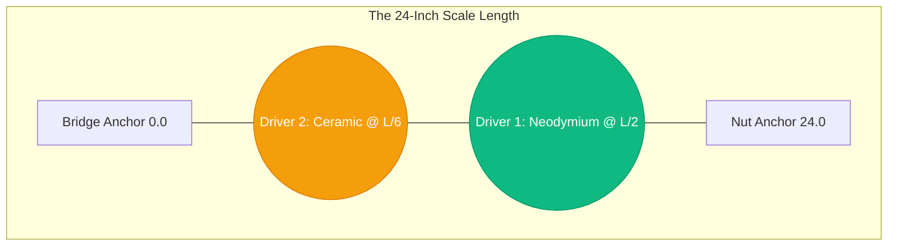

# Part 6.4: Master Inventory Deployment Strategy

Based on the complex mathematics of Spatial Coupling ($C_n$), Inverse-Square Magnetic Drag ($F_{pull}$), and Eddy Current induction, here is the absolute optimal structural layout for your specific hardware inventory (Neodymium Magnets and Ceramic Magnets).

By dedicating specific magnet types to specific locations along the $24$-inch scale length, you create a "David and Goliath" array that perfectly covers the entire frequency spectrum.

## 1. The "Goliath" Engine: Driver 1
**Specs:** Dual Neodymium Bar Magnets | 8-Ohm Coil | Placed at exactly $L/2$ (12.0 inches).

*   **The Mission:** To provide the unstoppable, brute-force pushing power required to swing the massive fundamental wave of heavy-gauge strings.
*   **The Z-Axis Rule:** Because the Neodymium creates immense magnetic drag ($F_{pull}$), and because the string swings widest at $L/2$, you **must** sink this driver deep into the chassis. Maintain a minimum air gap of **4.0mm to 5.5mm**.
*   **The Amplifier Rule:** Because Neodymium is highly conductive, the coil will induce eddy currents and localized heat. By keeping the coil at 8 Ohms, you restrict the Class-D amp to 1.5 Watts, keeping the system ice-cold while the massive $B_0$ multiplier does the heavy lifting.

## 2. The "David" Scalpel: Driver 2
**Specs:** Dual Ceramic Bar Magnets | 4-Ohm Coil | Placed at exactly $L/6$ (4.0 inches from Bridge).

*   **The Mission:** To target and excite the high-frequency 3rd and 6th harmonics, injecting bright "shimmer" and overtone feedback into the audio.
*   **The Z-Axis Rule:** Because Ceramic magnets have a weak static pull, they will not magnetically lock the string. Because the string is close to the bridge, its physical excursion is very tight. Therefore, you can mount this driver extremely close to the strings (an air gap of **1.5mm to 2.0mm**) for maximum mechanical leverage.
*   **The Amplifier Rule:** Because Ceramic is an electrical insulator, it suffers zero eddy current loss. By using a 4-Ohm coil, you allow the Class-D amp to push a full 3.0 Watts of clean, high-frequency AC power ($B_{ac}$) without generating parasitic heat inside the magnets.

## 3. The Control Interface (The Dashboard)
To fully harness this array, your electronic control plate requires three specific components:

1.  **Independent Power Switches:** You must be able to turn Driver 1 and Driver 2 on/off independently. This allows you to play the instrument in pure Bass Drone mode, pure Treble Chime mode, or Hybrid Superposition mode.
2.  **The Phase Toggle (DPDT):** A switch connected exclusively to Driver 2 (Ceramic). This allows you to flip the system between Constructive and Destructive interference on the fly, acting as your mechanical "EQ" and harmonic accelerator.
3.  **Master Gain (Potentiometer):** An audio-taper pot placed *before* the input of the Class-D amplifier. This allows you to turn the overall system gain down. Sometimes infinite sustain is achieved at only 40% power; pushing 100% power can cause the strings to violently crash against the frets.

### Spatial Map: The Master Chassis Layout
