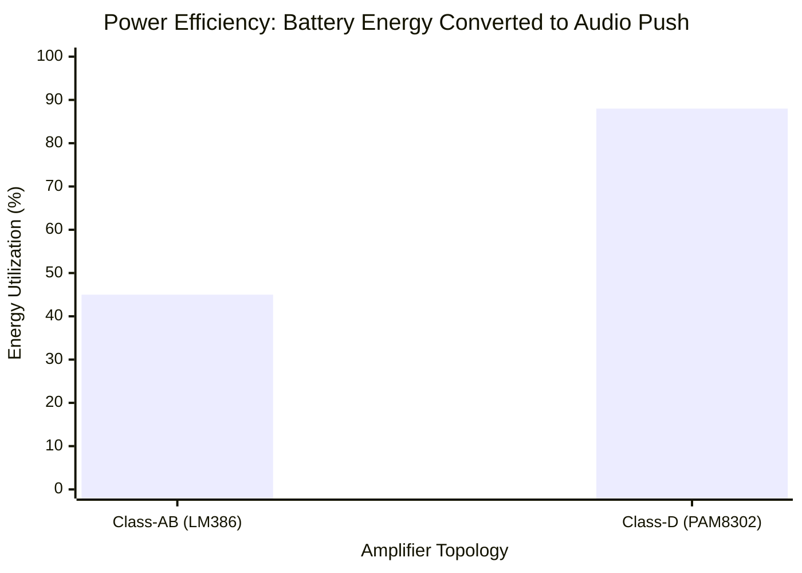

# Part 7.1: Micro Amplifier Topologies (Class-D vs. Class-AB)

To drive the electromagnetic array, the system requires a power amplifier to convert the micro-voltage acoustic signal into high-current AC power. Because this system is meant to be housed within a guitar chassis or small control box, it relies on low-voltage ($5\text{V}$ to $9\text{V}$) micro-amplifier ICs.

Understanding the topology of the chip you choose is critical, as it dictates your power supply requirements and thermal management.

## 1. Class-AB Architecture (The LM386)
The LM386 is one of the most famous hobbyist audio chips in the world. It operates on a Class-AB topology.
*   **The Physics:** A Class-AB amplifier uses a linear transistor output stage. Transistors are constantly "partially on" to prevent crossover distortion.
*   **Efficiency:** Because it relies on linear voltage drop, the LM386 is highly inefficient (roughly **40% to 50% efficiency**). The rest of the battery's energy is bled off directly as heat.
*   **Voltage Requirements:** It prefers higher voltages ($9\text{V}$ to $12\text{V}$). Running an LM386 on a $5\text{V}$ USB bank provides very poor headroom and low current output.
*   **The Verdict:** While the LM386 works for a 12-inch prototype, its thermal inefficiency and high voltage requirements make it a poor choice for a master dual-driver array.

## 2. Class-D Architecture (The PAM8302 / PAM8403)
Modern micro-amplifiers (like the PAM series) utilize a Class-D topology. 
*   **The Physics:** Instead of using linear transistors, a Class-D amplifier uses Pulse Width Modulation (PWM). It turns the output transistors fully ON or fully OFF hundreds of thousands of times per second (e.g., $250\text{ kHz}$). The width of these high-frequency pulses mathematically averages out to create the analog audio wave.
*   **Efficiency:** Because the transistors are acting as digital switches (fully open or fully closed), almost zero power is wasted across them. Class-D chips achieve **85% to 90% efficiency**. 
*   **Voltage Requirements:** Designed specifically for modern portable electronics, they run perfectly on a strict **$5\text{V}$ rail** (like a USB battery bank or standard 9V battery stepped down via an LDO regulator). 

### Performance Domain: Efficiency Comparison

*(The remaining percentage is wasted as thermal heat inside the silicon chip).*

## 3. Selecting the IC for the Master Array
For a multi-driver array utilizing independent $L/2$ and $L/6$ electromagnets, the **PAM8403** is the absolute optimal choice.
*   It is a **Stereo** Class-D amplifier.
*   It provides two completely independent output channels ($3\text{W} + 3\text{W}$). 
*   This allows you to wire the Center Driver to the Left channel and the Bridge Driver to the Right channel. 
*   By placing independent volume potentiometers (attenuators) before the Left and Right inputs of the chip, you gain complete mixing console control over the amplitude of your fundamental vs. your harmonic overtones.