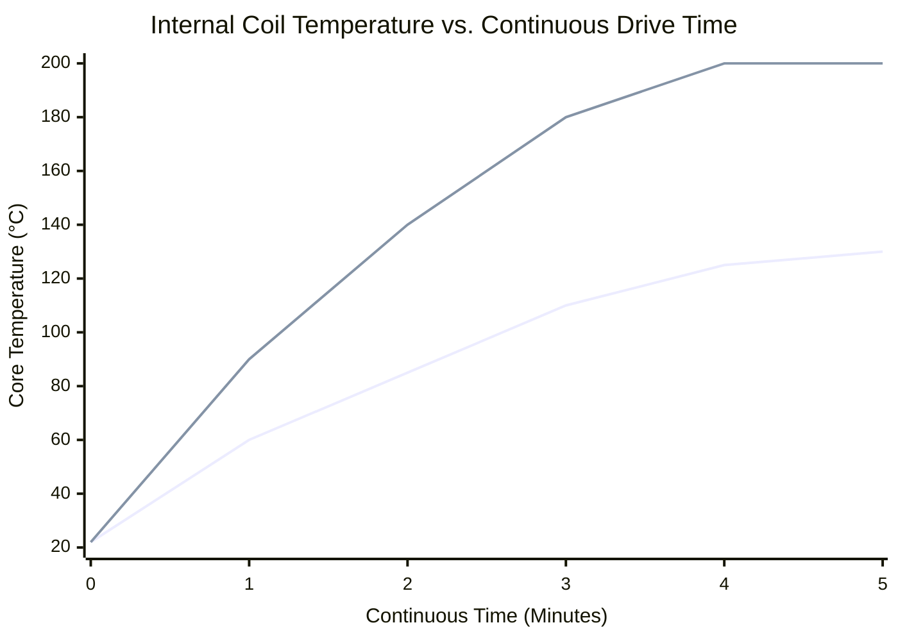

# Part 7.2: Wattage Ceilings and Thermal Limits

In traditional audio engineering, higher wattage is generally desired for louder, cleaner sound. In an electromagnetic sustainer loop, pumping high wattage into a stationary coil will trigger catastrophic thermal failure. 

Because the system operates at a **100% duty cycle** (a continuous, unrelenting sine wave) instead of the dynamic peaks and valleys of normal music, the RMS thermal load is incredibly high.

## 1. The $I^2R$ Heating Equation
The heat generated inside your driver is governed by Joule heating. The power dissipated as heat ($P_{loss}$) inside the copper wire is proportional to the square of the current ($I$) multiplied by the resistance ($R$):

$$P_{loss} = I^2 \cdot R$$

When operating on a $5\text{V}$ rail with a $4\text{-Ohm}$ coil, the PAM8302 amplifier will push roughly $3.0\text{ Watts}$ of power into the driver. 
*   Current ($I$) $\approx 0.86\text{ Amps}$.
*   $(0.86)^2 \cdot 4 \approx \mathbf{3.0\text{ Watts}}$ of pure heat generated inside the bobbin every single second.

## 2. The 3.0 Watt Absolute Ceiling
The insulation on standard 28 AWG magnet wire is a thin polyurethane/polyamide coating. It is typically rated for a maximum operating temperature of $130^\circ\text{C}$ to $155^\circ\text{C}$.

If the coil is heavily potted in wax, the wax acts as a thermal bridge, pulling heat away from the core wires and dissipating it into the air. However, even with perfect potting, $3.0\text{ Watts}$ is the absolute physical limit for a coil wound with 28 AWG wire.

### Time-Temperature Domain: Thermal Runaway
If you were to hook this driver up to a $10\text{-Watt}$ amplifier, the $I^2R$ heat generation would radically outpace the thermal dissipation of the wax.

*(The bottom blue line represents a safe $3\text{W}$ Class-D drive finding thermal equilibrium. The top red line represents a $10\text{W}$ drive. At roughly 2.5 minutes, the $10\text{W}$ drive exceeds $155^\circ\text{C}$, the wire enamel melts, the coil shorts out, and the driver is permanently destroyed).*

## 3. The Neodymium Advantage
Because heat scales with the square of the current ($I^2$), dropping the current drastically lowers the thermal risk. 

By building your $L/2$ Center driver with **Neodymium** magnets and winding it to **8 Ohms**, you restrict the Class-D amplifier to roughly **$1.5\text{ Watts}$** of power. 
*   Current ($I$) drops from $0.86\text{A}$ to roughly $0.43\text{A}$.
*   Because current is squared, the internal heat generation drops by nearly **75%**. 
*   Because the Neodymium's static field ($B_0$) is so massive, the driver still outputs violent mechanical force, but runs completely ice-cold.