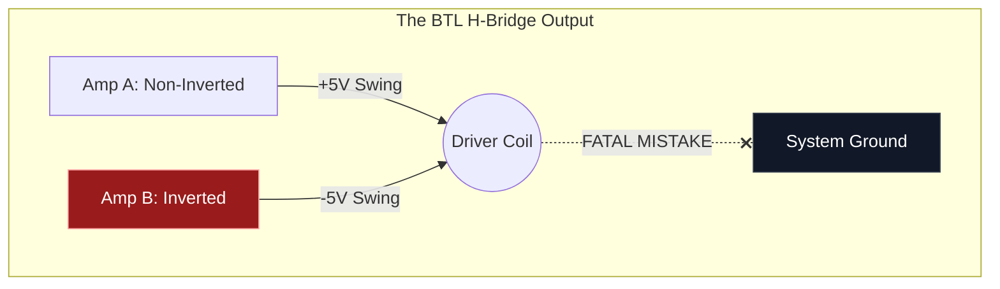

# Part 7.3: BTL Architecture and the Fatal Grounding Flaw

This is the single most common reason DIY builders destroy their Class-D amplifier chips on the first try. 

Unlike traditional vintage amplifiers (which use a single output wire and dump the return current to ground), modern micro-amplifiers utilize a **Bridge-Tied Load (BTL)** architecture to maximize power from a tiny $5\text{V}$ battery.

## 1. The Physics of BTL (Double Voltage Swing)
A $5\text{V}$ power supply can normally only swing an AC wave between $0\text{V}$ and $+5\text{V}$ (or $\pm 2.5\text{V}$ around a virtual ground). This severely limits output wattage.

To bypass this, a BTL chip contains two internal amplifiers for every one output channel. 
*   **Amp A (Positive Pin):** Plays the audio signal normally. 
*   **Amp B (Negative Pin):** Plays the exact same audio signal, but **180 degrees out of phase** (inverted).

When Amp A swings to $+5\text{V}$, Amp B simultaneously swings to $-5\text{V}$ (relative to each other). 
*   **The Math:** The voltage difference across your coil is $+5\text{V} - (-5\text{V}) = \mathbf{10\text{V}_{pk-pk}}$.
*   **The Result:** By bridging the load across two active amplifiers, a BTL chip artificially doubles the voltage swing, quadrupling the power output ($P = V^2 / R$) from a tiny $5\text{V}$ rail.

## 2. The Fatal Grounding Flaw
Because the "Negative" output pin on the PAM8302 / PAM8403 is actually an actively driven, high-current AC output (Amp B), **it is NOT a ground.**

### The Typical Guitar Wiring Mistake
In standard guitar wiring, the negative lead of a pickup is always soldered to the back of a potentiometer (the common chassis ground). 
*   **The Failure Mode:** If you wire your electromagnetic driver into your guitar, and you accidentally solder the Negative output wire from the Class-D chip to the guitar's ground (or if the metal shielding of the driver wire touches the grounded copper tape in your cavity), you have created a dead short.
*   **The Destruction:** Amp B inside the chip will attempt to dump massive AC voltage directly into the ground plane with zero resistance. The chip will instantly draw infinite current, overheat, and self-destruct (often with a visible spark or smoke).

## 3. The Implementation Rule
**Total Isolation.** The two wires coming from the `OUT+` and `OUT-` pins of your Class-D amplifier must run directly, and only, to the two wires of your copper coil. 

They must never touch the guitar's shielding, the input jack ground, the potentiometer casings, or any other grounding wire in the system. The driver circuit must remain completely "floating" relative to the rest of the instrument's audio ground.