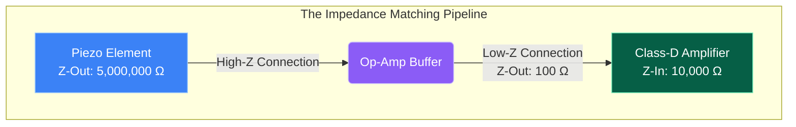

# Part 7.4: Piezo Buffers and Impedance Matching

If you are using a Piezoelectric contact microphone or under-saddle piezo element as the "listener" (the receiver) for your feedback loop, you cannot wire it directly into the input of a Class-D amplifier. 

Doing so will cause catastrophic signal loss, destroying the low frequencies and sending a tiny, harsh, heavily filtered signal to your driver. This is caused by an **Impedance Mismatch**.

## 1. The Physics of Piezo Impedance ($Z_{out}$)
Unlike magnetic pickups (which are low-impedance inductors), a piezo crystal acts electrically like a tiny capacitor. It produces a very high voltage, but it has almost zero electrical current. 

*   The Output Impedance ($Z_{out}$) of a standard piezo element is massive—typically between **$1\text{ M}\Omega$ and $10\text{ M}\Omega$** (1 to 10 million ohms) at low frequencies.

## 2. The Voltage Divider Failure
The audio input pin on a standard micro Class-D amplifier (like the PAM8302) is designed for cell phones or laptops. It has a relatively low Input Impedance ($Z_{in}$), typically around **$10\text{ k}\Omega$ to $20\text{ k}\Omega$**.

When you connect a high-$Z$ output to a low-$Z$ input, they form a **Voltage Divider circuit**.
$$V_{in} = V_{piezo} \cdot \left( \frac{Z_{in}}{Z_{in} + Z_{out}} \right)$$

*   **The Math:** $V_{in} = 1\text{V} \cdot \left( \frac{10\text{k}}{10\text{k} + 5000\text{k}} \right) = \mathbf{0.002\text{V}}$
*   **The Result:** The Class-D amplifier physically drags the piezo signal down to near zero. Furthermore, because the piezo is capacitive, this mismatch forms a high-pass filter, completely stripping all the fundamental bass frequencies out of the signal. The driver will receive nothing but a harsh, hissing treble signal.

## 3. The Solution: The High-Z Buffer Stage
To preserve the signal, you must place an active buffer circuit between the Piezo and the Class-D amplifier.

A buffer is an active electronic circuit (usually built with a JFET transistor or an Operational Amplifier) that has a voltage gain of exactly 1.0 (it doesn't make the signal louder). Its only job is impedance transformation.

*   **Input Stage:** The buffer provides a massive input impedance (e.g., **$10\text{ M}\Omega$**). The piezo "sees" this massive wall, meaning none of its voltage is dragged down, and all of the deep bass frequencies are preserved.
*   **Output Stage:** The buffer converts the signal and spits it out with a very low output impedance (e.g., **$100\text{ Ohms}$**). 
*   **The Result:** The Class-D amplifier "sees" the $100\text{-Ohm}$ buffer output, accepts the signal perfectly, and amplifies the full, rich frequency spectrum to push into the electromagnets.

**Implementation Note:** You can build a simple, highly effective JFET buffer using a single **J201 or 2N5457 transistor**, a $3\text{M}\Omega$ resistor to ground, and a coupling capacitor. It will run perfectly off the same $5\text{V}$ power rail as the Class-D amplifier.