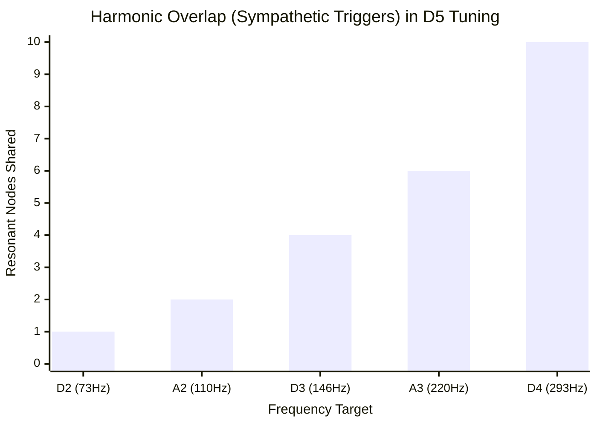

# Part 8.1: The 6-String Sympathetic Drone Matrix

When utilizing a continuous electromagnetic driver, standard guitar tuning (E-A-D-G-B-E) introduces too many dissonant intervals. Because the strings are constantly receiving kinetic energy, these dissonances will crash into each other, creating a muddy, unusable wall of noise.

To maximize the "shimmer" and sympathetic resonance of the instrument, the strings must be tuned to specific mathematical intervals that perfectly support the fundamental wave being pushed by your $L/2$ and $L/6$ drivers. 

## 1. The Physics of Sympathetic Excitation
Sympathetic resonance occurs when the vibration of one string physically forces an adjacent string to begin vibrating without being struck. This energy transfers through the air and through the physical wood chassis of the instrument.

For this to happen efficiently, String B must be tuned to a mathematical integer (harmonic) of String A.
*   **1:1 (Unison):** 100% energy transfer.
*   **2:1 (Octave):** Very high energy transfer.
*   **3:2 (Perfect 5th):** High energy transfer. 

## 2. The Core Modal Tunings

### A. The "Open D5" Array (The Power Drone)
**Tuning (Low to High): D2 - A2 - D3 - A3 - D4 - D4**

Also known as "Ostrich Tuning," this completely removes all Major and Minor third intervals. Every single string is tuned to either the Root (D) or the Perfect 5th (A).
*   **The Sympathetic Advantage:** Because your drivers are positioned at $L/2$ (favors roots) and $L/6$ (favors 5ths), this tuning perfectly aligns the physical hardware with the acoustic mathematics of the strings. The energy transfer is nearly absolute.
*   **The Dual-Unison Cap:** The top two strings are tuned identically (D4). If you tune one string roughly 2 to 4 cents flat, they will physically "beat" against each other in the air, creating a natural, swirling analog chorus effect.

### B. The DADGAD Wash (The Ambiguous Drone)
**Tuning (Low to High): D2 - A2 - D3 - G3 - A3 - D4**

Famous in Celtic music, this tuning creates a "Suspended 4th" chord. 
*   **The Sympathetic Advantage:** It retains the massive D/A power-chord bottom end for your $L/2$ driver to push, but introduces a G3. Because there is no Major or Minor 3rd to dictate emotion, the chord sounds vast, floating, and unresolved.
*   **The Feedback Loop:** When your $L/6$ driver pushes the 3rd harmonic (the 5th interval) of the C strings, it will literally output the frequency of a G string. This causes the G3 string to self-excite, creating an automatic, cascading loop.

### C. The Hindustani Sitar Resonance (Open C)
**Tuning (Low to High): C2 - G2 - C3 - G3 - C4 - E4**

By dropping the overall pitch down to C, the mechanical tension on the neck decreases slightly, but the acoustic weight of the instrument becomes massive (cello-range).
*   **The Tension Point:** This tuning introduces the E4 string at the very top—the **Major 3rd** interval. 
*   **Driver Interaction:** The Major 3rd is the 5th harmonic of the fundamental C string. Your offset driver will struggle slightly to push this overtone, but when it catches, the E4 string will ring out with incredible, bell-like clarity above the dark C/G drone on the lower 5 strings.

### Frequency Domain: Open D5 Sympathetic Overlap

*(Notice how the higher strings share exponentially more harmonic nodes with the lower strings. The massive fundamental waves of the D2 and A2 act as engines, pumping energy up into the D4 strings).*